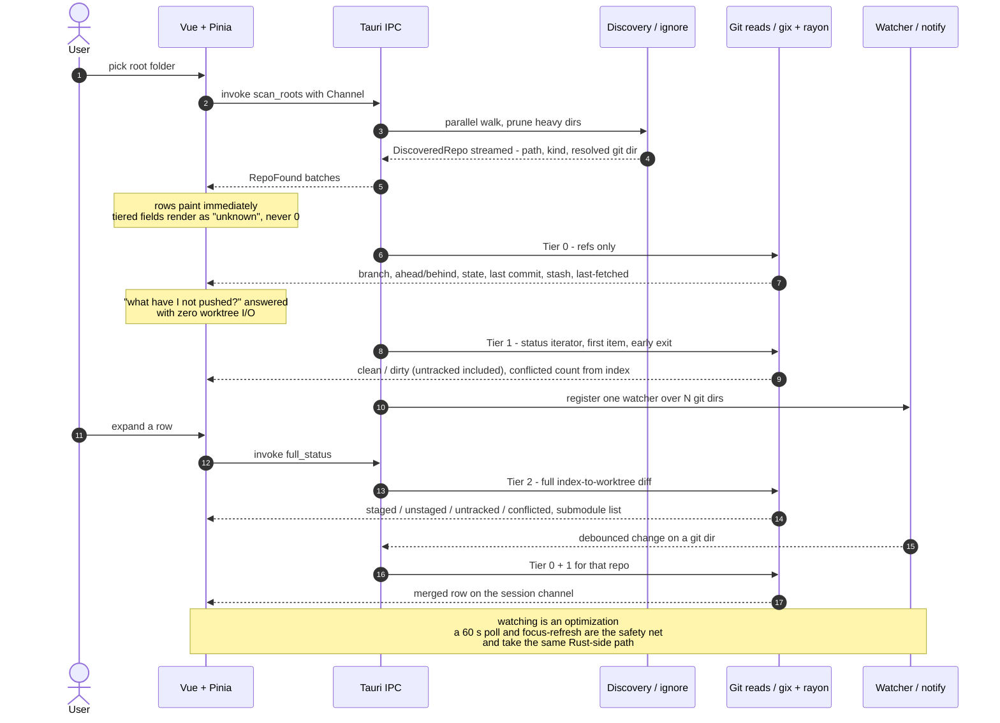

# AGENTS.md — `repo-viewer`

A Tauri 2 desktop app: Rust backend, Vue 3 frontend. Points at a folder, reports Git status for
every repo beneath it. See [README.md](./README.md) for orientation and commands;
**[PLAN.md](./PLAN.md) is the specification** — design decisions, roadmap, open questions. Start
with PLAN.md §11 when picking up work: it names the current phase, and while one is in progress
that phase has a runbook in `docs/`. Between phases `docs/` is empty and §11 says so — a missing
runbook is not a missing file.

This app also exists to prove Tauri + Vue as a delivery pattern for offline client apps against a
local SQL database. That is why the frontend stack matches `WPT.Dashboard` and why `src-tauri/`
stays thin: both must transfer.

## Commands

`vp` fronts everything — deps, scripts, tasks. **Never run `pnpm` / `npm` / `yarn` scripts
directly**; `vp install` / `vp add` / `vp remove` / `vp run` delegate through the pinned package
manager and preserve catalog overrides that ad-hoc calls corrupt. (CI uses `pnpm exec vp …` only
because `vp` is not global on an ADO agent — a pipeline detail, not a pattern to copy.)

| Need                                      | Command                                                                                         |
| ----------------------------------------- | ----------------------------------------------------------------------------------------------- |
| Dev, full app                             | `vp run dev`                                                                                    |
| Dev, frontend only                        | `vp dev`                                                                                        |
| Check everything (fmt, lint, `.ts` types) | `vp check`                                                                                      |
| Auto-fix                                  | `vp check --fix`                                                                                |
| Vue SFC type-check                        | `vp run typecheck` — `vue-tsc` over `src/`; plain `.ts` is covered by `vp check`                |
| Tests                                     | `vp test run`                                                                                   |
| Build + installer                         | `vp run build`, then `vp run verify` asserts the bundle is a production build                   |
| Regenerate TS types                       | `vp run types` — wraps `cargo test -p repo-scan --features typescript`                          |
| Add a dependency                          | `vp add <pkg>` then pin it exact in the catalog                                                 |
| Bump a dependency                         | `vp update -L <pkg>`                                                                            |
| Rust checks                               | `vp run rust` — `cargo fmt --check && cargo clippy --all-targets -- -D warnings && cargo test`  |
| Engine without the GUI                    | `cargo run --release --example scan -- <path>` (add `--rows` for one line per repo)             |
| A tree to time against                    | `cargo run --release --example synth -- <dir> [count] [depth]` — generated, so safe to write to |

Imports: configs from `vite-plus`, tests from `vite-plus/test`. **Never `vite` / `vitest`
direct** — `vite-plus/oxlint-plugin` enforces this.

## Architecture invariants

Break any of these and the design stops working. They are not style preferences.

- **`crates/repo-scan/` has no Tauri dependency.** All discovery, Git reads, watching, and fetch
  live there. `src-tauri/` is glue: commands, state, channel adaptation. If engine code needs a
  Tauri type, the boundary is in the wrong place.
- **`src/scripts/ipc.ts` is the only file that imports `@tauri-apps/api`, and no
  `@tauri-apps/plugin-*` package exists in the frontend.** Components and stores go through
  `ipc.ts`; dialog, opener, and store are reached through the app's own commands, from their
  Rust APIs. Keeps the IPC surface auditable, the capabilities file at `core:default`, and
  components testable with `mockIPC`. Test files are the one exception: they import
  `@tauri-apps/api/mocks`, which is the harness rather than the API.
- **The frontend does no Git logic, no path manipulation, and no filesystem access.** Rust owns
  all of it.
- **Rust owns the canonical row state.** `src-tauri/src/state.rs` holds the one
  `HashMap<PathBuf, RepoStatus>`, merges each tier into it, and sends the full merged row. The
  Pinia store is a mirror keyed by path: it never merges tiers and never holds a value Rust does
  not. Commands that take a path accept only a key of that map.
- **Everything streams over `tauri::ipc::Channel`; `emit()`/`listen()` are not used.** Tauri's
  event system is documented as "not designed for low latency or high throughput" — payloads are
  always JSON strings. One `Channel<ScanEvent>` per scan, one `Channel<RepoEvent>` per session
  opened by `subscribe` at startup for watcher, poll, and fetch pushes. Batch sends (~50 ms, or
  25 repos) rather than one per repo. Every scan event carries its `ScanId`; the frontend drops
  events from any scan it did not ask for.
- **One `notify` watcher for all repos.** `notify` spawns a thread per `Watcher`, so N watchers
  means N threads. Create one and call `watch()` per repo, non-recursively, on the git dir only —
  which discovery already resolved onto `DiscoveredRepo.git_dir`, including the indirection for a
  worktree or submodule whose `.git` is a file. Do not re-resolve it.
- **Uncomputed tiers render as unknown, never as `0`.** Every tiered field is `Option`, and the UI
  must say "counting…" rather than showing a number it does not have. This is the most common bug
  in this class of app. The corollary for a repository that cannot be read at all: it produces
  **no** `RepoStatus`. Tier 0's fields are not `Option`, so a row for it would have to invent a
  `head`; it stays a `DiscoveredRepo` and the failure is a value on `Tier0Summary.errors`. A
  repository that _was_ read but lost one field keeps its row, with that field `None` and the cause
  on `RepoStatus.error`.
- **Ahead/behind lives in exactly one module.** `status/ahead_behind.rs` is the only file that
  names `rev_walk`; if that primitive changes, this file is the blast radius. There is deliberately
  no backend trait. Its `ahead_behind` is the one public function in the engine whose signature
  names a `gix` type, so that the walk can be exercised on a single repository with a small cap
  instead of a thousand-commit fixture. `src-tauri` does not call it and has no `gix` dependency to
  call it with — keep it that way, and do not widen the exception: `model.rs` stays `gix`-free, so
  nothing from a pre-1.0 crate can cross IPC.

### The tiered scan

The reason the UI feels instant. A row appears before any worktree is touched.

Never move Tier 2 work into the default scan path. Tier 0 is refs-only and must stay that way.
A change notice never crosses IPC on its own: Rust refreshes and pushes the row.

## Hard rules

- **Every dependency version is exact**, declared once in `pnpm-workspace.yaml`'s `catalog:`
  (frontend) and `[workspace.dependencies]` in the root `Cargo.toml` (Rust). Bump deliberately
  with `vp update -L <pkg>`; never widen a range.
- **`typescript` stays at 6.0.3 until TypeScript 7.1 ships its programmatic API and `vue-tsc`
  runs on it.** `typescript@7.0.2` is `latest`, but its Go-native compiler exposes no stable API,
  so Volar and `vue-tsc` cannot use it and SFC type-checking breaks. `vue-tsc`'s peer range
  (`>=5.0.0`) will let you install the broken pair. Review the pin when 7.1 is released, not
  before; `vue-tsgo` is the interim bridge if it is needed sooner.
- **Two type checkers, split by file kind.** `vp check` type-checks plain `.ts` — `vite.config.ts`
  included — through tsgolint, which `lint.options.typeAware` + `typeCheck` enable and which ships
  inside `vite-plus`; it reports real compiler diagnostics (`TS2322`, `TS2769`), not just lint
  rules. It does **not** route Vue SFCs through `vue-tsc`; that is `vp run typecheck`, which
  `build` depends on. A separate `@typescript/native-preview` / `tsgo` package is **not** needed —
  verified redundant, and `tsgo` is not a dependency of this repo.
- **`tsconfig.node.json` has no explicit consumer and is still required.** tsgolint discovers it to
  resolve `@types/node` for `vite.config.ts`. Deleting it because nothing references it turns the
  config file's type errors into silence.
- **`vitest` stays at 4.1.11.** `vite-plus` 0.3.0 pins it and every `@vitest/*` internal to match.
  `vite` / `vite-plus` / `vitest` move in **lockstep**.
- **Node is 24, pinned in `engines` and `.node-version`.** pnpm enforces the `packageManager`
  field itself; corepack is not part of the setup and is not distributed with Node 25+. Pin and
  activate with `vp env pin 24.20.0 --target node-version` — no elevated shell, and unlike
  nvm-windows it actually reads the pin.
- **Build scripts are allowlisted in `pnpm-workspace.yaml`'s `allowBuilds:`.** pnpm 11+ blocks a
  dependency's install scripts unless it is named there. A blocked script is reported at install
  and then forgotten, so the symptom arrives later as a missing native binary. Add the package
  pnpm names; do not reach for `dangerouslyAllowAllBuilds`.
- **`app.security.csp` is set in `tauri.conf.json`.** The default is `null`, which is no CSP.
- **`bundle.active` is `true` in `tauri.conf.json`.** It defaults to **`false`**, and `tauri build`
  then completes successfully having produced no installer at all.
- **`[profile.release]` lives in the root `Cargo.toml`.** Cargo ignores profile sections in member
  crates with only a warning, so a `src-tauri`-local block silently ships an unoptimized binary.
- **`panic = "unwind"` and `opt-level = 3` in that profile.** Per-repo work runs under
  `catch_unwind` so a `gix` panic on one corrupt repo becomes `RepoStatus.error`; `abort` would
  take the app down, and rayon propagates worker panics. Do not copy `panic = "abort"` /
  `opt-level = "s"` from Tauri's app-size guide.
- **`model.rs` types are `gix`-free and `ts-rs`-expressible.** Hex `String` for ids, `u64`
  epoch-ms for times (`ts-rs` has no `SystemTime` impl), `rename_all = "camelCase"`, internally
  tagged enums. `ts-rs` mirrors serde attributes through its default `serde-compat` feature, so
  never restate `rename_all` or `tag` as `#[ts(...)]`.
- **Keep `[lib] name = "..._lib"`** in `src-tauri/Cargo.toml`. The suffix prevents a lib/bin name
  collision on Windows specifically ([cargo#8519](https://github.com/rust-lang/cargo/issues/8519)).
- `/target/` is gitignored at the **repo root**, not under `src-tauri/` — the workspace moves it.
- **`edition = "2024"`** in every crate, not the Tauri template's 2021.
- `thiserror` for the engine's typed errors; `anyhow` only at the `src-tauri` edge. Per-repo
  failures are values on `RepoStatus.error`, never panics, and never fatal to a scan.
- `ts-rs` output in `src/scripts/generated/` is **committed** so the frontend builds without Rust.
  Regenerate with `vp run types` (`cargo test -p repo-scan --features typescript`); CI fails on a
  diff. Keep the `-p`: the `typescript` feature belongs to the engine crate, and scoping to it
  avoids building `src-tauri` and its whole tree for a type-generation run.
- Bash under Windows: forward slashes, `/dev/null` (not `NUL`).
- **Git is read-only for agents.** Prepare commands; do not commit, push, fetch, or pull.

## Code conventions

Carried over from `WPT.Dashboard` — keep them identical so lessons transfer.

- `function foo()` declarations, not `const foo = () =>`.
- JSDoc every export. (oxfmt's `jsdoc` plugin handles formatting; just write the description.)
- Vue `<script setup>` section order: Imports → Type → Setup → Data → Composed → Computed →
  Watchers → Methods → Lifecycle. A `/// Section` divider per section except Imports.
- Import order: packages → `@/` → `./`, alphabetical, no blank lines between groups.
- Alias `@/*` → `src/*`.
- **Use `App*` wrappers at call sites — never raw `reka-ui` primitives.** Add a wrapper if one is
  missing.
- Unit tests sit beside their subject (`RepoTable.vue` + `RepoTable.test.ts`). `src/tests/` holds
  only shared harness and setup.
- Custom palette only. Stock Tailwind hues are blanked (`--color-*: initial`), so `bg-slate-500`
  silently nulls. `--spacing: 1px`, so `p-20` is 20px and `text-14` is pixel-literal.
- Derive `Debug` on public Rust types; return a crate-local `Result<T>` alias from `error.rs`.

## Documentation rules

- **Docs describe the current design and how to build it.** No evolution narration — no "used
  to", "as of \<date\>", "changed on", "renamed from". History lives in git log.
- **Measured traps and operational gotchas are forward-facing and stay** — as present-tense
  facts, not war stories. That is what the section below is.
- When the design changes, update every affected doc in the same pass. A doc that narrates its
  own edit history is a defect.
- Code comments follow the same rule: rationale yes, changelog no.

## Durable failure shapes

Each of these has bitten. They are silent, which is why they are written down.

**pnpm 12 is ESM-only, and old launchers cannot start it.** It ships `bin/pnpm.mjs` and no
`pnpm.cjs`, and its `bin` map changed shape. Launchers that predate it still look for the CJS
entry and die with `Cannot find module …\pnpm\12.3.4\bin\pnpm.cjs` — which reads as a corrupt
download rather than a version mismatch, because the tarball did extract correctly. Two on this
machine were too old: **corepack 0.34.0** (bundled with Node 22) and **`vp` 0.2.2**. `vp upgrade`
to 0.3.1+ fixes it. Corepack is not part of this setup at all — if a `pnpm` on `PATH` turns out to
be a corepack shim, that is the bug. Relevant to the Phase 8 CI leg, which installs pnpm itself.

**Tauri's Vite guide has two wrong values.** They fail identically on plain Vite 8 and on
`vite-plus`, since vite-plus-core 0.3.0 _is_ Vite 8.2.2:

- `build.minify: 'esbuild'` is deprecated in Vite 8 and slated for removal; Oxc is the minifier.
  Use `'oxc'`, or omit the key — `'oxc'` is the default.
- `envPrefix: ['VITE_', 'TAURI_ENV_*']` exposes nothing. `envPrefix` is a literal `startsWith`
  prefix, not a glob, so the trailing `*` matches no variable and
  `import.meta.env.TAURI_ENV_PLATFORM` is `undefined`. Use `'TAURI_ENV_'`. Config-side
  `process.env.TAURI_ENV_PLATFORM` works either way, which is exactly why it goes unnoticed.

**A production build needs `NODE_ENV=production` _and_ `--mode production`.** The `vp` task runner
sets `NODE_ENV`, and Vite derives `isProduction` from it, overriding `--mode`. A bundle built via
`vp run build` has `import.meta.env.DEV` **true** and `PROD` **false**, inverting every env guard
silently. Tauri's `beforeBuildCommand` invokes commands directly rather than through `vp run`, so
specify `vp build --mode production` there — and assert the built bundle's `PROD` flag in a test.

**`ts-rs` generates `u64` as `bigint`, not `number`.** Every time in `model.rs` is `u64` epoch-ms,
`serde_json` writes it as a JSON number, and `JSON.parse` hands the frontend a `number` — so the
default binding is a type that is simply false, and the lie only surfaces where someone does
arithmetic on it. `TS_RS_LARGE_INT = "number"` in `.cargo/config.toml` fixes it. Both entries there
also set `force = true`, because Cargo's `[env]` defaults to **not** overriding an ambient value,
which would otherwise redirect the generated output somewhere else entirely.

**`.git` is often a file, not a directory.** Linked worktrees and submodules write a `.git` _file_
containing `gitdir: <path>`. `path.join(".git").is_dir()` silently misses both. Test existence,
then resolve. Bare repos have no `.git` at all — detect via `HEAD` + `objects/` + `refs/`.

**Do not hand-roll that resolution: `gix::discover::is_git` is it.** `gix/src/discover.rs` is
`pub use gix_discover::*`, ungated by any feature, so `is_git(path)` and `repository::Kind` are
public API. It follows a `.git` file, requires a valid HEAD plus `objects/` and `refs/`, and
returns a `Kind` that maps onto `RepoKind` directly: `WorkTree { linked_git_dir: None }` is
`Normal`, `Some(_)` is `LinkedWorktree`, `Submodule` is `Submodule`, `PossiblyBare` is `Bare`. It
tells a worktree from a submodule by whether a `commondir` sits beside the private Git directory,
which is correct where matching `worktrees/` or `modules/` in the path is merely usually right.
Two caveats: `PossiblyBare` is documented as a guess that can misfire on a freshly `init`ed
repository with no index, and it is only ever reached by probing a directory that has no `.git`,
so gate that probe on `HEAD` existing or pay three `stat`s on every directory walked.

**`filter_entry` cannot be where a repository is recorded.** Its contract is that a `false`
predicate _drops the entry_ and does not descend — so detecting `.git` there means the repository
never reaches the visitor and is silently omitted. The prune predicate handles names only;
detection lives in the visitor, which records the row and returns `WalkState::Skip` to stop the
descent. Related: `ignore::Error` exposes no `path()`, and nests the path up to three layers deep
inside `WithPath` / `WithDepth` / `WithLineNumber`, so a permission error has to be unwrapped by
hand before it can be reported against a path. And `WalkState::Quit` is documented as
asynchronous — more entries can arrive after it, which matters for §6.4 cancellation.

**Local-path submodules are refused by default, which breaks fixture builds.** Since the fix for
CVE-2022-39253, `git submodule add` rejects the `file` transport, and a plain local path counts.
The failure is a transport error that reads like a bad path, so it gets debugged as a fixture
pathing bug. Every `git` invocation in `tests/support/fixtures.rs` passes
`-c protocol.file.allow=always`. Those invocations also point `GIT_CONFIG_GLOBAL` and
`GIT_CONFIG_SYSTEM` at a non-existent file, so the developer's own `core.autocrlf`, hooks, and
templates cannot change the shape of the tree under test.

**`gix::Repository::is_dirty()` ignores untracked files.** Its docs say so, and it disables the
directory walk internally. A repo whose only change is a new file reports clean. The dirty flag
comes from the status iterator with `untracked_files(Collapsed)`, first item, `should_interrupt`.

**`gix`'s `with_boundary` is not `^rev`.** It stops the walk at the given commits but does not
hide their ancestors, so ahead/behind over any merged history overcounts. Use `with_hidden`,
which the docs equate to `^branch-to-not-list`, and cap the walk — disjoint histories can make
it visit everything. It also forces `Sorting::ByCommitTimeCutoff`, which drops commits older than
the cutoff, so the trap has an undercounting half too.

**`Head::id()` reports the tag, not the commit, on a detached HEAD.** It resolves
`Detached { peeled, target }` as `peeled.unwrap_or(target)`, and `peeled` is only ever populated
from a `packed-refs` `^` line — a loose `.git/HEAD` holding a bare object id gives `peeled: None`.
So a HEAD detached onto an annotated tag hands back the tag's id and calls it a commit. Use
`Head::try_peel_to_id()`, which reads the object header and peels tags to their end; it costs
nothing extra on the common symbolic case. `git checkout <annotated-tag>` writes the commit id, so
git will not put a repository into this state on its own — the fixture for it writes the tag id
into `.git/HEAD` by hand, because nothing short of that reproduces it.

**`Commit::time()` is the committer's time, not the author's.** Its own doc says to use
`commit.author()?.time()` for authorship. A rebase rewrites committer time and leaves authorship
alone, so the committer's clock makes old work look new. And `gix_date::Time.seconds` is a signed
`i64` that can predate 1970, so converting to `u64` epoch-ms must saturate rather than wrap —
otherwise a bogus clock lands in the year 584 million.

**`gix` 0.87.1 has no stash API.** The only occurrence of "stash" in the crate is a sample hook
asset. The count is what `git stash list` reads: the `refs/stash` reflog, one line per entry, via
`try_find_reference("refs/stash")` then `Reference::log_iter().all()`. Use `all()` and not `rev()`,
whose own docs call it expensive and only suitable for the last few entries. An absent `refs/stash`
is a count of zero, not a failure — it is the overwhelmingly common case.

**`FETCH_HEAD` lives in the common directory, not the Git directory.** For a linked worktree
`Repository::git_dir()` is the private `worktrees/<name>` directory, which never holds one, so
reading it there reports "never fetched" forever. Use `Repository::common_dir()`. `state()` is the
opposite case — it reads `git_dir()`, which is correct, because a parked rebase _is_ per-worktree.
The two accessors are not interchangeable.

**`gix::state::InProgress` has ten variants; `RepoState` has five plus `Clean`.** Map it with **no
wildcard arm**, so a new variant on the next `gix` bump is a compile error rather than a silent
`Clean` — reporting an in-progress operation as "nothing going on" is the
uncomputed-renders-as-zero bug in enum form. `Clean` comes only from `state()` returning `None`.
The sequence variants fold into their single-commit form, `ApplyMailbox*` into `Rebasing` (git's
own prompt shows those as `AM`/`AM/REBASE`), and `Revert`/`RevertSequence` into `Reverting`.

**`open_opts` re-runs discovery unless you tell it not to.** By default it joins `.git` onto the
path and calls `gix_discover::is_git`, repeating per repository the classification the walk already
did — and `Path::ends_with` compares whole components, so `mirror.git` does not look like a `.git`
directory to it. Pass `open::Options::default().open_path_as_is(true)` against the resolved
`git_dir`. `ThreadSafeRepository::open_from_paths` is `pub(crate)`, so one `is_git` validation is
the floor. Leave the ownership-based trust check alone: it is what downgrades config trust for a
repository owned by someone else, which is a real case on a share. What cannot be avoided is
`gix::open` re-parsing the global and system config for every repository; 0.87.1 exposes no shared
snapshot, and it is the residual per-repo cost in the §11 numbers.

**`Repository::submodules()` is not a refs read at any granularity.** It reads `.gitmodules` from
the **worktree**, and when that file is absent it falls back to parsing the whole `.git/index` and
then the HEAD tree. `Submodule::index_id()` parses the index; `head_id()` opens the submodule's own
repository. So the submodule list is Tier 2 in full — not even names and paths belong in Tier 0.
`Submodule` also holds an `Rc`, so it is `!Send` and cannot cross a rayon boundary.

**`catch_unwind` around an already-open `Repository` needs `AssertUnwindSafe`,** because the
repository holds interior mutability for its object caches. A caught panic still runs the process
panic hook, so a corrupt repository prints a message and a backtrace even on a passing test run —
the engine does not install a hook, because a library must not own the process's.

**git writes commit-graphs on its own, which invalidates a naive baseline measurement.**
`git commit` runs `git maintenance run --auto`, and the commit-graph task's threshold
(`maintenance.commit-graph.auto`) is 100 commits not yet in the graph. A seed repository deep
enough for a revision walk to be worth measuring therefore writes itself a chained commit-graph
unasked, `git clone --local` hardlinks it into every clone, and a "without a commit-graph" run
silently becomes a second "with" one — off by 10× and in the flattering direction. Any generator
for that comparison passes `-c maintenance.auto=false -c gc.auto=0`, and deletes
`objects/info/commit-graph{,s}` afterwards to be sure.

**A non-recursive watch on `.git/refs/` misses most ref updates.** It sees only direct children,
so `refs/heads/feature/x` and every `refs/remotes/origin/*` update are invisible. Watch `refs/`
recursively (it is tiny), the git-dir root non-recursively, and `logs/HEAD`.

**Windows long paths bite on the way out, not in.** `std::fs` already applies the `\\?\` prefix
for long paths, so the walk does not fail on deep `node_modules`. `canonicalize()` _returns_
`\\?\C:\...` paths, which render badly, confuse `git` CLI arguments, and compare unequal to the
typed form. Canonicalize through `dunce`. Junctions and reparse points are reported as symlinks
by `std`, so `follow_links(false)` covers them.

**A spawned `git` flashes a console window on Windows.** Every `Command` for `git fetch` sets
`creation_flags(CREATE_NO_WINDOW)` and `GIT_TERMINAL_PROMPT=0`, and has a timeout — a credential
or SSH prompt with no terminal otherwise hangs the process forever.

**Defender for Endpoint on CIT-managed machines blocks unsigned executables.** It denies
execution of freshly downloaded, low-prevalence binaries with `os error 5` even when ACLs are
correct, before SmartScreen is ever involved. An unsigned installer cannot be clicked through;
signing or an IT allow indicator is a prerequisite for distributing to colleagues.

**Git writes `.git/index` three times per operation.** It writes `index.lock`, writes, then
renames, so one `git add` produces a create/modify/remove burst. Debouncing
(`notify-debouncer-full`, ~300–500 ms, plus a per-repo cooldown) is mandatory, not an
optimization. Never let a watcher callback block: if it stalls, OS events pile up in the kernel
buffer and are dropped on overflow.

**Watching is never the source of truth.** `notify`'s own docs warn it "may fail to receive all
events" at high file counts. Linux inotify has a per-user watch limit that surfaces as "No space
left on device" — detect that specific error and print the `sysctl` fix rather than failing
opaquely. Always ship the ~60 s poll and refresh-on-focus.

**Ahead/behind is relative to the last fetch, not the remote.** It is measured against
`refs/remotes/origin/*`. Never present it without the `last_fetched` age beside it.

## External docs — fetch, do not guess

`gix` is pre-1.0 and its API churns on minor bumps; `vite-plus` is 0.3.x; Tauri plugins move
independently of the core. Look up the current signature rather than recalling one. The pinned
versions are in [PLAN.md §3](./PLAN.md), and its References section lists the primary sources.
