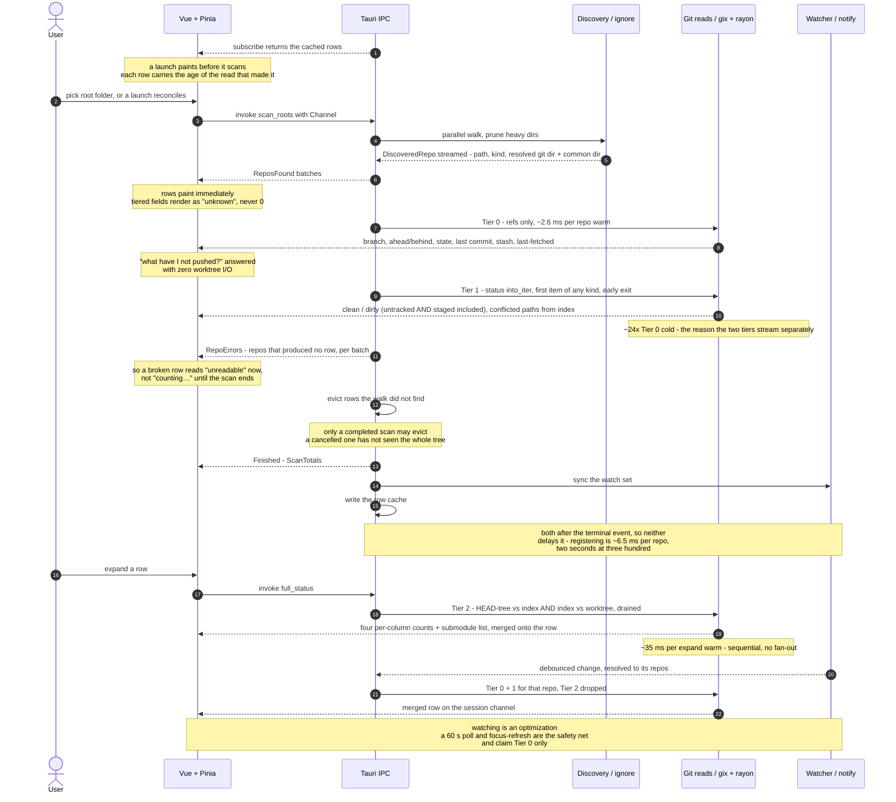

# AGENTS.md — `repo-viewer`

A Tauri 2 desktop app: Rust backend, Vue 3 frontend. Points at a folder, reports Git status for
every repo beneath it. See [README.md](./README.md) for orientation and commands;
**[PLAN.md](./PLAN.md) is the specification** — design decisions, roadmap, open questions. Start
with PLAN.md §11 when picking up work: it names the current phase, and while one is in progress
that phase has a runbook in `docs/`. Between phases §11 says no phase is open and `docs/` is empty
— or absent, since git does not track an empty directory. A missing runbook is not a missing file.

This app also exists to prove Tauri + Vue as a delivery pattern for offline client apps against a
local SQL database. That is why the frontend stack matches the sibling dashboard app and why `src-tauri/`
stays thin: both must transfer.

## Commands

`vp` fronts everything — deps, scripts, tasks. **Never run `pnpm` / `npm` / `yarn` scripts
directly**; `vp install` / `vp add` / `vp remove` / `vp run` delegate through the pinned package
manager and preserve catalog overrides that ad-hoc calls corrupt. (CI uses `pnpm exec vp …` only
because `vp` is not global on a GitHub Actions runner — a pipeline detail, not a pattern to copy.)

| Need                                       | Command                                                                                                             |
| ------------------------------------------ | ------------------------------------------------------------------------------------------------------------------- |
| Dev, full app                              | `vp run dev`                                                                                                        |
| Dev, frontend only                         | `vp dev`                                                                                                            |
| Check everything (fmt, lint, `.ts` types)  | `vp check`                                                                                                          |
| Auto-fix                                   | `vp check --fix`                                                                                                    |
| Vue SFC type-check                         | `vp run typecheck` — `vue-tsc` over `src/`; plain `.ts` is covered by `vp check`                                    |
| Tests                                      | `vp test run`                                                                                                       |
| Build + installer                          | `vp run build`, then `vp run verify` asserts the bundle is a production build                                       |
| Offline installer (second Windows pair)    | `pnpm exec tauri build --config src-tauri/tauri.offline.conf.json` — **same filenames**, stage the first pair first |
| Launch the built binary and check it lives | `vp run smoke` — Linux needs `xvfb-run` in front                                                                    |
| The build actually emitted installers      | `vp run bundles` — the only thing that notices a build that bundled nothing                                         |
| Versions agree across the three files      | `vp run versions`                                                                                                   |
| Regenerate the app icons                   | `pnpm exec tauri icon src-tauri/icons/source.svg`                                                                   |
| Regenerate TS types                        | `vp run types` — wraps `cargo test -p repo-scan --features typescript`                                              |
| Add a dependency                           | `vp add <pkg>` then pin it exact in the catalog                                                                     |
| Bump a dependency                          | `vp update -L <pkg>`                                                                                                |
| Rust checks                                | `vp run rust` — `cargo fmt --check && cargo clippy --all-targets -- -D warnings && cargo test`                      |
| Engine without the GUI                     | `cargo run --release --example scan -- <path>` (`--rows`, `--tier2`, `--watch`)                                     |
| Time a fetch (**writes** — needs `--yes`)  | `cargo run --release --example scan -- <path> --fetch --yes`                                                        |
| A tree to time against                     | `cargo run --release --example synth -- <dir> [count] [depth]` — generated, so safe to write to                     |

Imports: configs from `vite-plus`, tests from `vite-plus/test`. **Never `vite` / `vitest`
direct** — `vite-plus/oxlint-plugin` enforces this.

### Git hooks, and the cold gate

`prepare` runs `vp config --no-agent` on install, which points `core.hooksPath` at
`.vite-hooks/_` — a dispatcher that ignores itself, so only hooks written by hand are committed.
`--no-agent` because that flag's other job is rewriting agent instructions, and this file is
hand-maintained.

Two hooks. **Pre-commit** is `staged: { '*': 'vp check --fix' }` in `vite.config.ts`, so whatever
is being committed is formatted and linted first. **Pre-push** is `.vite-hooks/pre-push`, which
mirrors CI's Checks job: `vp check`, a `--no-cache` typecheck, `vp test run`, `vp run versions`,
`vp run rust`.

**Everything in that gate is cold on purpose.** `vp run` caches tasks _and_ scripts, and on a hit
it replays captured stdout without executing anything — so a warm green `vp run` can report success
against code it never re-ran, while CI runs cold and catches what the replay hid. `typecheck` is
the one cached task here, which is why the hook passes `--no-cache` to it specifically. Never report
"passes" from a cached `vp run`.

CI sets `VP_GIT_HOOKS=0`: a runner clones once and never pushes, so installing hooks there is pure
cost. `git push --no-verify` skips the gate locally — for an emergency, not for a hurry.

### Editor settings

`.vscode/settings.json` and `extensions.json` are committed, as they are in the sibling repos, and
carry the same house block: oxc as the default formatter, format-on-save, `source.fixAll.oxc`,
`npm.scriptRunner: vp`, `oxc.fmt.configPath` pointed at `vite.config.ts`, file nesting, and the
Tailwind bindings. Three deliberate deviations, all because this repo is not a pure frontend:

- **`target/` and `dist/` are excluded from the file watcher and search.** No sibling repo needs
  this. Measured here: `target/` is **19 GB across 29,020 files**, against 297 MB for
  `node_modules`, so letting the editor watch and index it is a real cost rather than a tidiness
  preference.
- **Rust gets its own formatter binding and `rust-analyzer.check.command: "clippy"`** with
  `--all-targets`, so the editor reports exactly what `vp run rust` and CI report. Left on the
  default `cargo check`, clippy failures would appear for the first time in the pre-push gate.
- **`*.md` is not nested under `vite.config.*`.** The house pattern hides it there, which is fine
  where the markdown is incidental. Here PLAN.md is the specification and AGENTS.md is this file;
  burying them under a build config is the wrong default.

## Architecture invariants

Break any of these and the design stops working. They are not style preferences.

- **`crates/repo-scan/` has no Tauri dependency.** All discovery, Git reads, watching, and fetch
  live there. `src-tauri/` is glue: commands, state, channel adaptation. If engine code needs a
  Tauri type, the boundary is in the wrong place.
- **The engine spawns no _detached_ threads, and has no `mpsc`.** Cross-thread work is rayon plus
  atomics plus an `on_*` callback — the callback is the channel. The one exception is `fetch.rs`,
  whose pool is `std::thread::scope`: a fetch is a blocking subprocess measured in seconds, so
  putting it on rayon would park workers that Tier 0 and Tier 1 share, and there is no way to
  bound in-flight work to four across a 300-item `par_iter` except chunking, which serialises
  within a chunk. Scoped threads keep the property the habit protects — bounded by the concurrency
  cap, joined before the call returns, unable to outlive their borrows, and a worker panic
  surfaces at the join rather than vanishing. What is still forbidden is a thread nobody owns.
- **`src/scripts/ipc.ts` is the only file that imports `@tauri-apps/api`, and no
  `@tauri-apps/plugin-*` package exists in the frontend.** Components and stores go through
  `ipc.ts`; dialog, opener, and store are reached through the app's own commands, from their
  Rust APIs. Keeps the IPC surface auditable, the capabilities file at `core:default`, and
  components testable with `mockIPC`. Test files are the one exception: they import
  `@tauri-apps/api/mocks`, which is the harness rather than the API.
- **The frontend does no Git logic, no path manipulation, and no filesystem access.** Rust owns
  all of it.
- **`src-tauri/src/persist.rs` is the only file that uses `tauri_plugin_store`**, beyond the one
  line in `lib.rs` that registers it. Two files under
  it, because they have two lifetimes: `settings.json` is what the user meant — roots, the
  `openIn` commands, the `watch` and `fetch` settings, and the view state — and is left on the plugin's own
  auto-save; `cache.json`
  is the whole row map, written once at the end of a scan and again on exit, with auto-save
  **disabled**. Everything else asks `persist` for a value or hands it one.

  The view state is the **one shape on the wire `ts-rs` does not generate**. Chips, sort keys and
  grouping are vocabulary of the table, Rust never reads inside the object, and typing it in Rust
  would mean either putting UI concepts in the engine crate — the crate the SQL appendix swaps out —
  or a `ts-rs` derive in `src-tauri` that breaks `vp run types`' `-p` scoping. So it crosses as
  opaque JSON and `src/scripts/settings.ts` owns the shape, the way `CommandError` crosses as a
  bare string. The cost is real and is paid there: the file is hand-editable, nothing validates it
  on the way in, and `parseUiSettings` therefore treats every field as absent until proven
  otherwise, field by field.

- **A cached row is a claim about the past, and its `scanned_at` age is what makes it honest.**
  Nothing on the load path refreshes it. Tier 2 is the exception and is dropped on load, because
  the drawer shows its counts with no age beside them — dropped, the first expand reads them again
  and says `counting…` while it does, which is true.
- **Only a completed scan may evict a row.** `AppState::retain_scanned` drops rows the walk did not
  see, scoped to the roots it walked, and the evicted paths go out on the session channel as
  `RepoEvent::Removed`. A cancelled walk has not seen the whole tree, so what it missed is not the
  same as what is gone. This is what lets a launch reconcile remove a repository deleted between
  sessions — every other row change is an upsert.
- **Rust owns the canonical row state.** `src-tauri/src/state.rs` holds the one
  `HashMap<PathBuf, RepoStatus>`, merges each tier into it, and sends the full merged row — on the
  scan's `Channel<ScanEvent>` for a scan result, on the session `Channel<RepoEvent>` for a watcher,
  poll, or fetch push. The Pinia store is a mirror keyed by path: it never merges tiers and never
  holds a value Rust does not. A command that takes a repository path accepts only a key of one of
  the two maps below — never an arbitrary string from the webview; a command that takes a _root_
  validates against the root list instead, and `add_root` is the single place a new path enters,
  canonicalised through `repo_scan::canonical` so a root stays a prefix of the row keys beneath it.

  A **second** map beside the rows holds what discovery found, keyed identically. `RepoStatus`
  carries no `git_dir` and every engine entry point needs the resolved one, which discovery already
  produced and must not be re-derived. It is a **superset** of the rows — a repository whose HEAD
  was unreadable has an entry here and no row — and which map a command checks follows from what it
  needs: `full_status` requires a row to merge Tier 2 into, so it checks the rows; `refresh_repo`
  and `open_in` check this one. For `refresh_repo` that is what lets the §8.1 total-failure grade be
  retried without rescanning the tree; for `open_in` it is what lets a user reveal the repository
  that would not open, which is the one they most need to go and look at. `remove_root` evicts from
  both, and so does the eviction a completed scan performs.

- **The merge is tier ownership, not option preference.** Each tier replaces every field it owns,
  `None` included, and leaves other tiers' fields alone. `upstream`, `ahead`, `behind`,
  `last_commit` and `last_fetched_ms` are `Option` because the _answer_ can be none — not because
  the value is uncomputed — so preferring a stale `Some` over a fresh `None` would report a deleted
  upstream as live forever. Only `dirty`, `conflicted`, `counts` and `submodules` mean "not yet"
  when `None`. `state.rs` has a test for each half; they are the only inputs on which a correct
  merge and a wholesale replace disagree while Tier 0 is the sole writer. There is exactly one
  exception, and it is a **separate operation** rather than a merge that behaves differently —
  `AppState::invalidate_tier2`, described three bullets down.
- **Everything streams over `tauri::ipc::Channel`; `emit()`/`listen()` are not used.** Tauri's
  event system is documented as "not designed for low latency or high throughput" — payloads are
  always JSON strings. One `Channel<ScanEvent>` per scan, one `Channel<RepoEvent>` per session
  opened by `subscribe` at startup, carrying watcher, poll, and fetch pushes plus the one thing on
  it that is not a row — `RepoEvent::WatchFailed`, which is how §7.4's guidance reaches a user
  rather than only a log. Batch sends (~50 ms, or
  25 repos) rather than one per repo. Every scan event carries its `ScanId`; the frontend drops
  events from any scan it did not ask for — but the id **cannot** be the primary filter, because
  Rust starts the pipeline before `scan_roots`'s reply crosses back and a batch can arrive before
  the id is known. `src/scripts/scan.ts` keys acceptance on a generation counter captured in the
  handler closure before the invoke, and uses the id as the guard on top.
- **One `notify` watcher for all repos.** `notify` spawns a thread per `Watcher`, so N watchers
  means N threads. `crates/repo-scan/src/watch/` holds the one, and `watch/set.rs` is the only
  place the §7.2 set is decided: the git dir root non-recursively, `refs/` **recursively**, and
  `logs/HEAD`. Both directories for a linked worktree, because `DiscoveredRepo` carries `git_dir`
  **and** `common_dir` and discovery resolved both — do not re-resolve either.

  The reverse index is watched path → **the repositories that asked for it**, plural, and it
  doubles as the reference count. A linked worktree shares its common directory with the
  repository it came from, so one `refs/remotes/` write there moves both their ahead/behind counts
  and both are reported; and a path is unwatched only when its last holder goes, or removing a
  worktree would silently stop reporting its parent's commits.

  **The worktree itself is never watched.** Recursively watching worktrees means recursively
  watching `node_modules`. A worktree-only edit is picked up by the poll, by refresh-on-focus, or
  by the `index` write that follows any `git add` — measured: an edit with no `git add` produces no
  event at all, and the `git add` produces exactly one.

- **The poll owns Tier 0, the watcher owns Tiers 0 and 1, and only the watcher invalidates Tier 2.**
  Same tier-ownership rule, applied to triggers. A watcher event is evidence that something
  changed, so `AppState::invalidate_tier2` nulls `counts` and `submodules` for that row — the one
  deliberate exception to "a tier leaves other tiers' fields alone", made for the reason
  `persist.rs` makes it on the load path: the drawer shows those counts with no age beside them, so
  a pre-change count reads as freshly measured. A poll tick is evidence only that time passed, so it
  claims Tier 0 and touches neither `dirty` nor `counts`; nulling on a timer would put a
  `counting…` flicker in an untouched drawer every minute. And `refresh_repo` never invalidates:
  it was asked for the tiers it names.

  Invalidating obliges the frontend, because `counting…` must be transient. Rust cannot discharge
  that — which rows are expanded is window state — so `src/scripts/detail.ts`'s `EnsureDetail` is
  called for every expanded row in a session update and re-reads Tier 2 when its counts have gone.
  Without it an open drawer claims work in progress for the rest of the session.

- **A fetch owns the refresh of the repositories it touches, and the watcher must not duplicate
  it.** A fetch writes `FETCH_HEAD` and `refs/remotes/*`, both of which are in the §7.2 watch set,
  so every fetch makes the watcher report the repository it just fetched — a 300-repository pass
  would run 300 redundant Tier 0+1 refreshes on top of the ones the fetch already did.
  `AppState::begin_fetch_group` takes ownership before the process is spawned, and `live.rs`'s
  `due_paths` withholds those paths from the refresh it would otherwise drive.

  **The suppression is a deadline, never bare set membership.** A path left in a set by a fetch
  that panicked, timed out or was dropped stops that repository updating for the rest of the
  session — silently, because nothing fails and nothing logs. So the entry expires on its own at
  `timeout + tail`; the explicit release and `FetchGuard`'s sweep are optimisations on top of that
  floor rather than the only things standing between a user and a dead row. Release keeps a
  **tail** derived from `debounce_ms`, because the fetch's own writes are still inside the
  debouncer when the process exits and an immediate release just delays the duplicate.

  **Suppression defers a notice, it does not drop one.** A fetch writes nothing Tier 2 measures, so
  a fetch alone must not invalidate — but the notice it suppressed might have been the user's own
  `git add`, and `resolve` does not report which file moved. So the entry records that a notice
  arrived and `end_fetch_group` reports it, and Tier 2 is invalidated then. The rule above survives
  verbatim: the watcher's evidence is still the only thing that invalidates, just delivered late.
  It is a derivation rather than a new exception, and the difference is observable — with
  `watch.enabled: false` no notice arrives, nothing defers, and a fetch behaves exactly like
  `refresh_repo`, which is what it is.

  In the filter chain, **suppression is checked before the cooldown**. `Cooldown::due` _records_
  `now` when it answers `true`, so the other order burns a suppressed path's slot on a refresh that
  never happens, and the first genuine event after release is dropped for another 750 ms.

- **Uncomputed tiers render as unknown, never as `0`.** Every tiered field is `Option`, and the UI
  must say "counting…" rather than showing a number it does not have. This is the most common bug
  in this class of app. The corollary for a repository that cannot be read at all: it produces
  **no** `RepoStatus`. Tier 0's fields are not `Option`, so a row for it would have to invent a
  `head`; it stays a `DiscoveredRepo` and the failure is a value — on `ScanEvent::RepoErrors` as its
  batch is read, and again in `ScanTotals.errors` at the end. A repository that _was_ read but lost
  one field keeps its row, with that field `None` and the cause on `RepoStatus.error`.
- **"counting…" is a claim that work is in progress, so it must be transient.** The four kinds of
  absence are four different facts and `AppUnknown` is the single place they are worded, because
  collapsing any two of them is how the rule above gets diluted:
  - `pending` → "counting…" — a tier that has not run **yet**. Never for a tier that will not run,
    and never for one whose run nothing will trigger: a column left on this for the life of a
    session is a false claim of activity, and it costs a user an overnight wait for a number that
    was never coming. Whatever sets it must guarantee something clears it.
  - `na` → "n/a" — cannot ever apply. A bare repository has no worktree, so its `dirty` is not
    pending.
  - `unreadable` → red, with the cause — tried and failed. Two independent ways to know, and either
    is enough: `ScanEvent::RepoErrors` reports a repository as the batch that failed is read, so a
    row can be known-unreadable **mid-scan**; and a row still lacking a status once Tier 0 has
    finished is this too, whether or not its cause arrived. Do not infer the second from the absence
    of the first — "an error arrived for this path" and "Tier 0 is done" are separate facts, and the
    frontend keeps them as separate state for that reason.
  - `none` → an em dash — there is genuinely no such value, e.g. no tip commit on an unborn HEAD.

  And a computed `false` is not an absence: a clean worktree is `Some(false)` and reads "clean".

- **A filter and a sort are two more places the same lie can be told.** Excluding a row whose tier
  has not run reports it as one that did not match — a `dirty` chip applied mid-scan would silently
  call every uncounted row clean. So a chip has **three** answers per row in `src/scripts/view.ts`,
  not two: matched, not matched, and not yet knowable, with the third counted and shown as
  "N still counting". A row that produced no `RepoStatus` at all is never hidden by a status chip,
  because it has no field to judge and is the row most worth looking at. And `null` sorts **last in
  both directions**: it is not a small number, it is no answer, so reversing a sort must not promote
  every uncomputed value to the top.

- **Ahead/behind lives in exactly one module.** `status/ahead_behind.rs` is the only file that
  names `rev_walk`; if that primitive changes, this file is the blast radius. There is deliberately
  no backend trait. Its `ahead_behind` is the one public function in the engine whose signature
  names a `gix` type, so that the walk can be exercised on a single repository with a small cap
  instead of a thousand-commit fixture. `src-tauri` does not call it and has no `gix` dependency to
  call it with — keep it that way, and do not widen the exception: `model.rs` stays `gix`-free, so
  nothing from a pre-1.0 crate can cross IPC.

### The tiered scan

The reason the UI feels instant. A row appears before any worktree is touched.
`src-tauri/src/pipeline.rs` is the whole of it: discovery streams into `stream.rs`'s batcher, each
batch is emitted, then read by Tier 0, merged, emitted, read by Tier 1, merged and emitted again.
**Never fold two tiers into one send** — that holds the cheap answer back for the expensive one and
undoes the point.

Never move Tier 2 work into the default scan path. Tier 0 is refs-only and must stay that way.
A change notice never crosses IPC on its own: Rust refreshes and pushes the row.

Tier 2 is the one tier with **no rayon fan-out**, and that is deliberate rather than missing: it
runs for one expanded row at a time, so a `read_tier2_all_with` would exist only to be called from
the pipeline — which is the thing this section forbids. `full_status` merges it and returns the
whole row; `refresh_repo(path, tier)` re-reads tiers `0..=tier` and both returns the row and pushes
it on the session channel.

The read itself is `live::refresh_one`, and it has three callers: that command, the watcher's
refresh thread, and the fetch driver's drain loop. None of them reimplements it, which is what
keeps a user-requested refresh, a watcher-driven one and a post-fetch one from disagreeing about
what a refresh is. The **poll** deliberately does not use it — a whole-tree pass wants
`read_tier0_all_with`'s rayon fan-out rather than three hundred sequential opens — so what the four
triggers share is Rust-side ownership and the merge-then-push, not one function.

**A fetch is the fourth trigger, and it takes Tier 1.** Not a `last_fetched_ms` patch: a fetch moves
`behind`, can move `ahead`, moves the tracking ref's tip, and with `--prune` can remove `upstream`
outright, so writing one field would leave four stale beside it — §8.2's premise inverted. Tier 1
rather than Tier 0 because the fetch **suppresses the watcher** for the repositories it touches
(see the invariant below), and the watcher's notice is what would otherwise have caught a `git add`
made while the fetch ran.

## Hard rules

- **Every dependency version is exact**, declared once in `pnpm-workspace.yaml`'s `catalog:`
  (frontend) and `[workspace.dependencies]` in the root `Cargo.toml` (Rust). Bump deliberately
  with `vp update -L <pkg>`; never widen a range.
- **`typescript` stays at 6.0.3 until TypeScript 7.1 ships its programmatic API and `vue-tsc`
  runs on it.** `typescript@7.0.2` is `latest`, but its Go-native compiler exposes no stable API,
  so Volar and `vue-tsc` cannot use it and SFC type-checking breaks. `vue-tsc`'s peer range
  (`>=5.0.0`) will let you install the broken pair. Review the pin when 7.1 is released, not
  before; `vue-tsgo` is the interim bridge if it is needed sooner.
- **Two type checkers, split by file kind.** `vp check` type-checks plain `.ts` — `vite.config.ts`
  included — through tsgolint, which `lint.options.typeAware` + `typeCheck` enable and which ships
  inside `vite-plus`; it reports real compiler diagnostics (`TS2322`, `TS2769`), not just lint
  rules. It does **not** route Vue SFCs through `vue-tsc`; that is `vp run typecheck`, which
  `build` depends on. A separate `@typescript/native-preview` / `tsgo` package is **not** needed —
  verified redundant, and `tsgo` is not a dependency of this repo.
- **`tsconfig.node.json` has no explicit consumer and is still required.** tsgolint discovers it to
  resolve `@types/node` for `vite.config.ts`. Deleting it because nothing references it turns the
  config file's type errors into silence.
- **`vitest` stays at 4.1.11.** `vite-plus` 0.3.0 pins it and every `@vitest/*` internal to match.
  `vite` / `vite-plus` / `vitest` move in **lockstep**.
- **Node is 24, pinned in `engines` and `.node-version`.** pnpm enforces the `packageManager`
  field itself; corepack is not part of the setup and is not distributed with Node 25+. Pin and
  activate with `vp env pin 24.20.0 --target node-version` — no elevated shell, and unlike
  nvm-windows it actually reads the pin.
- **Build scripts are allowlisted in `pnpm-workspace.yaml`'s `allowBuilds:`.** pnpm 11+ blocks a
  dependency's install scripts unless it is named there. A blocked script is reported at install
  and then forgotten, so the symptom arrives later as a missing native binary. Add the package
  pnpm names; do not reach for `dangerouslyAllowAllBuilds`.
- **`app.security.csp` is set in `tauri.conf.json`.** The default is `null`, which is no CSP.
- **`bundle.active` is `true` in `tauri.conf.json`.** It defaults to **`false`**, and `tauri build`
  then completes successfully having produced no installer at all.
- **`[profile.release]` lives in the root `Cargo.toml`.** Cargo ignores profile sections in member
  crates with only a warning, so a `src-tauri`-local block silently ships an unoptimized binary.
- **`panic = "unwind"` and `opt-level = 3` in that profile.** Per-repo work runs under
  `catch_unwind` so a `gix` panic on one corrupt repo becomes `RepoStatus.error`; `abort` would
  take the app down, and rayon propagates worker panics. Do not copy `panic = "abort"` /
  `opt-level = "s"` from Tauri's app-size guide.
- **`model.rs` types are `gix`-free and `ts-rs`-expressible.** Hex `String` for ids, `u64`
  epoch-ms for times (`ts-rs` has no `SystemTime` impl), `rename_all = "camelCase"`, internally
  tagged enums. `ts-rs` mirrors serde attributes through its default `serde-compat` feature, so
  never restate `rename_all` or `tag` as `#[ts(...)]`.
- **Keep `[lib] name = "..._lib"`** in `src-tauri/Cargo.toml`. The suffix prevents a lib/bin name
  collision on Windows specifically ([cargo#8519](https://github.com/rust-lang/cargo/issues/8519)).
- `/target/` is gitignored at the **repo root**, not under `src-tauri/` — the workspace moves it.
- **`edition = "2024"`** in every crate, not the Tauri template's 2021.
- `thiserror` for the engine's typed errors; `anyhow` only at the `src-tauri` edge. Per-repo
  failures are values on `RepoStatus.error`, never panics, and never fatal to a scan.
- `ts-rs` output in `src/scripts/generated/` is **committed** so the frontend builds without Rust.
  Regenerate with `vp run types` (`cargo test -p repo-scan --features typescript`); CI fails on a
  diff. Keep the `-p`: the `typescript` feature belongs to the engine crate, and scoping to it
  avoids building `src-tauri` and its whole tree for a type-generation run.
- Bash under Windows: forward slashes, `/dev/null` (not `NUL`).
- **Git is read-only for agents.** Prepare commands; do not commit, push, fetch, or pull.

## Code conventions

Carried over from the sibling dashboard app — keep them identical so lessons transfer.

- `function foo()` declarations, not `const foo = () =>`.
- JSDoc every export. (oxfmt's `jsdoc` plugin handles formatting; just write the description.)
- Vue `<script setup>` section order: Imports → Type → Setup → Data → Composed → Computed →
  Watchers → Methods → Lifecycle. A `/// Section` divider per section except Imports.
- Import order: packages → `@/` → `./`, alphabetical, no blank lines between groups.
- Alias `@/*` → `src/*`.
- **Use `App*` wrappers at call sites — never raw `reka-ui` primitives.** Add a wrapper if one is
  missing.
- Unit tests sit beside their subject (`RepoTable.vue` + `RepoTable.test.ts`). `src/tests/` holds
  only shared harness and setup.
- Custom palette only. Stock Tailwind hues are blanked (`--color-*: initial`), so `bg-slate-500`
  silently nulls. `--spacing: 1px`, so `p-20` is 20px and `text-14` is pixel-literal.
- Derive `Debug` on public Rust types; return a crate-local `Result<T>` alias from `error.rs`.

## Documentation rules

- **Docs describe the current design and how to build it.** No evolution narration — no "used
  to", "as of \<date\>", "changed on", "renamed from". History lives in git log.
- **Measured traps and operational gotchas are forward-facing and stay** — as present-tense
  facts, not war stories. That is what the section below is.
- When the design changes, update every affected doc in the same pass. A doc that narrates its
  own edit history is a defect.
- Code comments follow the same rule: rationale yes, changelog no.

## Durable failure shapes

Each of these has bitten. They are silent, which is why they are written down.

**pnpm 12 is ESM-only, and old launchers cannot start it.** It ships `bin/pnpm.mjs` and no
`pnpm.cjs`, and its `bin` map changed shape. Launchers that predate it still look for the CJS
entry and die with `Cannot find module …\pnpm\12.3.4\bin\pnpm.cjs` — which reads as a corrupt
download rather than a version mismatch, because the tarball did extract correctly. Two on this
machine were too old: **corepack 0.34.0** (bundled with Node 22) and **`vp` 0.2.2**. `vp upgrade`
to 0.3.1+ fixes it. Corepack is not part of this setup at all — if a `pnpm` on `PATH` turns out to
be a corepack shim, that is the bug. It applies to CI too, where both workflows install pnpm
themselves with `npm i -g pnpm@12.3.4` for exactly this reason.

**Tauri's Vite guide has two wrong values.** They fail identically on plain Vite 8 and on
`vite-plus`, since vite-plus-core 0.3.0 _is_ Vite 8.2.2:

- `build.minify: 'esbuild'` is deprecated in Vite 8 and slated for removal; Oxc is the minifier.
  Use `'oxc'`, or omit the key — `'oxc'` is the default.
- `envPrefix: ['VITE_', 'TAURI_ENV_*']` exposes nothing. `envPrefix` is a literal `startsWith`
  prefix, not a glob, so the trailing `*` matches no variable and
  `import.meta.env.TAURI_ENV_PLATFORM` is `undefined`. Use `'TAURI_ENV_'`. Config-side
  `process.env.TAURI_ENV_PLATFORM` works either way, which is exactly why it goes unnoticed.

**A production build needs `NODE_ENV=production` _and_ `--mode production`.** The `vp` task runner
sets `NODE_ENV`, and Vite derives `isProduction` from it, overriding `--mode`. A bundle built via
`vp run build` has `import.meta.env.DEV` **true** and `PROD` **false**, inverting every env guard
silently. Tauri's `beforeBuildCommand` therefore points at `node tools/scripts/build-frontend.mjs`,
which sets the variable and then runs `vp build --mode production` — setting it inline in the
command string is not portable, because Tauri spawns that command through `cmd.exe` on Windows.
`vp run verify` asserts the built bundle's `PROD` flag, and is the only thing that catches this.

**A Windows checkout produces CRLF, oxfmt formats to LF, and the machine that made the commit is
the last place that shows.** Git for Windows defaults to `core.autocrlf=true`, so without
`.gitattributes` a checkout rewrites every text file to CRLF — and `vp check` then fails **every
file in the repository at once**, which reads as a broken formatter rather than as a checkout
difference. Measured: 93 of 93 files, including `Cargo.toml` and `.vscode/extensions.json`, on the
first CI run.

What hides it locally is that the failure is self-erasing. `vp check --fix` rewrites those files to
LF in place; Git compares them normalised, so `git status` stays clean while the bytes on disk no
longer match what a fresh checkout would produce. The committing machine passes forever and a
runner or a new clone fails immediately. `* text=auto eol=lf` in `.gitattributes` is the fix, and it
belongs there rather than in an oxfmt setting or a CI `git config` step — those would fix one
consumer and leave the next clone broken.

The tell, before CI ever runs: `git` printing "LF will be replaced by CRLF the next time Git touches
it" against files nobody deliberately changed. Do not read that as noise. It is the whole bug,
announced in advance.

**`ts-rs` generates `u64` as `bigint`, not `number`.** Every time in `model.rs` is `u64` epoch-ms,
`serde_json` writes it as a JSON number, and `JSON.parse` hands the frontend a `number` — so the
default binding is a type that is simply false, and the lie only surfaces where someone does
arithmetic on it. `TS_RS_LARGE_INT = "number"` in `.cargo/config.toml` fixes it. Both entries there
also set `force = true`, because Cargo's `[env]` defaults to **not** overriding an ambient value,
which would otherwise redirect the generated output somewhere else entirely.

**`.git` is often a file, not a directory.** Linked worktrees and submodules write a `.git` _file_
containing `gitdir: <path>`. `path.join(".git").is_dir()` silently misses both. Test existence,
then resolve. Bare repos have no `.git` at all — detect via `HEAD` + `objects/` + `refs/`.

**Do not hand-roll that resolution: `gix::discover::is_git` is it.** `gix/src/discover.rs` is
`pub use gix_discover::*`, ungated by any feature, so `is_git(path)` and `repository::Kind` are
public API. It follows a `.git` file, requires a valid HEAD plus `objects/` and `refs/`, and
returns a `Kind` that maps onto `RepoKind` directly: `WorkTree { linked_git_dir: None }` is
`Normal`, `Some(_)` is `LinkedWorktree`, `Submodule` is `Submodule`, `PossiblyBare` is `Bare`. It
tells a worktree from a submodule by whether a `commondir` sits beside the private Git directory,
which is correct where matching `worktrees/` or `modules/` in the path is merely usually right.
Two caveats: `PossiblyBare` is documented as a guess that can misfire on a freshly `init`ed
repository with no index, and it is only ever reached by probing a directory that has no `.git`,
so gate that probe on `HEAD` existing or pay three `stat`s on every directory walked.

**`filter_entry` cannot be where a repository is recorded.** Its contract is that a `false`
predicate _drops the entry_ and does not descend — so detecting `.git` there means the repository
never reaches the visitor and is silently omitted. The prune predicate handles names only;
detection lives in the visitor, which records the row and returns `WalkState::Skip` to stop the
descent. Related: `ignore::Error` exposes no `path()`, and nests the path up to three layers deep
inside `WithPath` / `WithDepth` / `WithLineNumber`, so a permission error has to be unwrapped by
hand before it can be reported against a path. And `WalkState::Quit` is documented as
asynchronous — more entries can arrive after it, which matters for §6.4 cancellation.

**Local-path submodules are refused by default, which breaks fixture builds.** Since the fix for
CVE-2022-39253, `git submodule add` rejects the `file` transport, and a plain local path counts.
The failure is a transport error that reads like a bad path, so it gets debugged as a fixture
pathing bug. Every `git` invocation in `tests/support/fixtures.rs` passes
`-c protocol.file.allow=always`. Those invocations also point `GIT_CONFIG_GLOBAL` and
`GIT_CONFIG_SYSTEM` at a non-existent file, so the developer's own `core.autocrlf`, hooks, and
templates cannot change the shape of the tree under test.

**`gix::Repository::is_dirty()` ignores untracked files.** Its docs say so, and it disables the
directory walk internally. A repo whose only change is a new file reports clean.

**And `into_index_worktree_iter()` ignores staged ones**, which is the half that gets missed. It
sets `head_tree = None`, so it compares the index against the worktree and nothing else — a
repository with a staged change and a clean worktree reports clean, and so does a parked merge whose
content is staged. `into_iter()` keeps the HEAD-tree comparison that `status()` sets up by default
and runs all three checks together: dirwalk for untracked, index-to-worktree for unstaged,
tree-to-index for staged. Any item means dirty. `crates/repo-scan/tests/tier1.rs` has one fixture
per trap plus a `git status --porcelain` oracle over the whole tree, because a single "dirty repo"
fixture lets two of the three mistakes pass. Interrupting takes
`should_interrupt_owned(Arc<AtomicBool>)` — `gix` wants an owned `Arc` or a `&'static` flag, not the
plain `&AtomicBool` Tier 0 takes — and the `Arc` handed over must be a **private** one, never the
shared cancellation flag. See the `should_interrupt_owned` trap below for why that distinction is
load-bearing rather than tidiness.

**A conflicted path has up to three index entries, not one.** Stages 1, 2 and 3 all describe the
same path, so counting non-zero-stage entries reports three times the number of conflicted files.
Count distinct paths — the index is sorted by path, so counting transitions needs no allocation.

**Tier 1 costs ~24x Tier 0 cold and ~6x warm.** Over `C:/Working/Source`, 52 repositories: Tier 0
322 ms cold / 136 ms warm, Tier 1 **7581 ms cold / 906 ms warm**. That gap is the entire argument
for streaming the tiers separately rather than waiting to paint a complete row, and it is why
Tier 2 is lazy. Always name the tree beside a timing — PLAN.md §11 carries figures for two
different roots, and they are only comparable once you notice which is which.

**Tier 2 is measured per repository, because that is the only way it runs.** ~35 ms warm for one
expand over the same tree, against Tier 0's ~2.6 ms per repo — so one expand costs roughly 13x a
whole row's refs. `cargo run --release --example scan -- <path> --tier2` walks the tree one
repository at a time purely to collect the spread, and its figure is always **warm**, because
Tier 1 has just touched the same worktrees in the same run. Do not compare that per-repo number
against Tier 0's or Tier 1's pass totals without noticing that both of those are rayon fan-outs and
this is sequential.

**`AHEAD_BEHIND_CAP` is duplicated in TypeScript, and both copies assert the literal.** `ts-rs`
exports types, not constants, so the cap lives in `crates/repo-scan/src/status/ahead_behind.rs` and
again in `src/scripts/utils.ts`. A count equal to it means "at least this many" and renders as
`1000+`, so a frontend copy that drifted low would present a capped value as exact.
`crates/repo-scan/tests/tier0.rs` and `src/scripts/utils.test.ts` each pin the number, which is
what makes moving one of them fail two tests rather than none. Shipping it on the wire was the
alternative and puts a build-time constant in a per-scan payload.

**A full row batch crosses Tauri's direct-`eval` threshold, and that is fine.** `BATCH_MAX = 25`
and `BATCH_WINDOW = 50 ms` live in `src-tauri/src/stream.rs`. Twenty-five rows is ~12–15 KB, past
the 8192-byte cutoff, so the batch takes the queue-plus-`fetch` path rather than a direct `eval`.
Do not shrink the batch to duck under it: 8192 is a crossover Tauri measured, not a cliff, and
going under trades one round trip for twice as many `eval`s queued on the event-loop thread — while
making the batch size depend on how long the user's paths happen to be. If whole-tree wall time
regresses, try a **larger** batch first: the pipeline pays `par_iter`'s join overhead once per
batch rather than once per tree.

**`ScanOpts.threads` sizes the walker only, and rayon takes the global pool.** Peak thread
population during a scan is therefore ~1.5x cores — the walker's half plus rayon's full — which is
deliberate: the walk is the short half and rayon has the machine to itself once it ends, so
oversubscription for the overlap window is much the cheaper error than halving the throughput of
the tier that dominates. The lever, if a measurement ever asks for one, is
`rayon::ThreadPoolBuilder::new().num_threads(n).build_global()` in `run()` — one line, no engine
change, but it must be called before the first `par_iter` and cannot be called twice. Do not
repurpose `ScanOpts.threads` for it without renaming the field; it is documented and generated as
the walker's count.

**Never take a timing from `vp run dev`.** That is a debug build, and `gix` in debug is roughly an
order of magnitude slower than in release: the app reports ~68 ms per repository for Tier 0 where
`cargo run --release --example scan` measures ~2.6 ms warm. Every number in this file and in
PLAN.md §11 comes from the release example, which is what `examples/scan.rs` exists for. A
regression hunt started from a dev-build figure is chasing the profile, not the code.

**`ScanTotals.elapsed_ms` is not the sum of its three per-stage fields, and must not be presented
as one.** `ScanEvent::Finished` carries `ScanTotals`, whose `elapsed_ms` is wall clock across the
whole pipeline while `discovery_ms`, `tier0_ms` and `tier1_ms` are sums of the per-batch passes.
The difference is the time spent waiting for the walk to hand over the next batch, which belongs to
no tier and is most of what a user experiences — so the four numbers are shown side by side and
never reconciled. `Tier0Summary` means only what Tier 0 did and is not the scan summary: reusing it
there leaves one `elapsed_ms` standing for the whole pipeline, which reads as Tier 0's cost and
blames the cheap tier for the expensive one's.

**Never hand a shared `Arc<AtomicBool>` to `gix`'s `should_interrupt_owned`.** It records the flag
as `private: false`, meaning `gix` may write to it: `parallel_iter_drop` does
`should_interrupt.swap(true, ..)` to stop its worker threads when a status iterator is dropped, and
only then tries to restore the previous value. Every other walk holding that same flag reads `true`
inside the window. Sharing the scan's cancellation flag across Tier 1's rayon fan-out therefore let
one dirty repository's early exit abort whichever neighbours were mid-walk, which came back as
`Interrupted` on a repository nothing had asked to stop — and because the fan-out and
`src-tauri`'s pipeline both poll that flag, a transient `true` could end the whole scan and report
it as cancelled. `status::private_interrupt` makes a per-walk flag seeded from the shared one, which
keeps "a walk that starts after the user cancels stops immediately" and gives up only interrupting
a walk already in flight. `crates/repo-scan/tests/tier1.rs` reproduces it by running the pass
repeatedly over a tree of mixed dirty and clean repositories.

**`gix`'s `with_boundary` is not `^rev`.** It stops the walk at the given commits but does not
hide their ancestors, so ahead/behind over any merged history overcounts. Use `with_hidden`,
which the docs equate to `^branch-to-not-list`, and cap the walk — disjoint histories can make
it visit everything. It also forces `Sorting::ByCommitTimeCutoff`, which drops commits older than
the cutoff, so the trap has an undercounting half too.

**`Head::id()` reports the tag, not the commit, on a detached HEAD.** It resolves
`Detached { peeled, target }` as `peeled.unwrap_or(target)`, and `peeled` is only ever populated
from a `packed-refs` `^` line — a loose `.git/HEAD` holding a bare object id gives `peeled: None`.
So a HEAD detached onto an annotated tag hands back the tag's id and calls it a commit. Use
`Head::try_peel_to_id()`, which reads the object header and peels tags to their end; it costs
nothing extra on the common symbolic case. `git checkout <annotated-tag>` writes the commit id, so
git will not put a repository into this state on its own — the fixture for it writes the tag id
into `.git/HEAD` by hand, because nothing short of that reproduces it.

**`Commit::time()` is the committer's time, not the author's.** Its own doc says to use
`commit.author()?.time()` for authorship. A rebase rewrites committer time and leaves authorship
alone, so the committer's clock makes old work look new. And `gix_date::Time.seconds` is a signed
`i64` that can predate 1970, so converting to `u64` epoch-ms must saturate rather than wrap —
otherwise a bogus clock lands in the year 584 million.

**`gix` 0.87.1 has no stash API.** The only occurrence of "stash" in the crate is a sample hook
asset. The count is what `git stash list` reads: the `refs/stash` reflog, one line per entry, via
`try_find_reference("refs/stash")` then `Reference::log_iter().all()`. Use `all()` and not `rev()`,
whose own docs call it expensive and only suitable for the last few entries. An absent `refs/stash`
is a count of zero, not a failure — it is the overwhelmingly common case.

**`FETCH_HEAD` is written to the Git directory of whichever worktree ran the fetch, so neither
directory alone is the answer.** For a normal repository the two are the same path and the
question does not arise. For a linked worktree it cuts both ways, and it is measured on git
2.54.0.windows.1 in both directions: a fetch run in the **parent** leaves a `FETCH_HEAD` in the
common directory and none in the worktree's private `worktrees/<name>` directory, and a fetch run
**in the worktree** leaves one in the private directory and none in the common one. The
`refs/remotes/*` both of them update are shared either way, which is why fetching a worktree moves
its parent's ahead/behind too.

So `tier0::fetch_head_ms` takes **both** and returns the newer. Reading only the common directory
is the obvious simplification and it is wrong: it reports "never fetched" for a repository fetched
a second ago, in the one field whose whole job is to say how stale the counts beside it are.
`crates/repo-scan/tests/fetch.rs` pins both directions.

`state()` is the genuinely one-sided case — it reads `git_dir()`, which is correct, because a
parked rebase _is_ per-worktree. The two accessors are not interchangeable, and `FETCH_HEAD` needs
neither of them on its own.

**`gix::state::InProgress` has ten variants; `RepoState` has five plus `Clean`.** Map it with **no
wildcard arm**, so a new variant on the next `gix` bump is a compile error rather than a silent
`Clean` — reporting an in-progress operation as "nothing going on" is the
uncomputed-renders-as-zero bug in enum form. `Clean` comes only from `state()` returning `None`.
The sequence variants fold into their single-commit form, `ApplyMailbox*` into `Rebasing` (git's
own prompt shows those as `AM`/`AM/REBASE`), and `Revert`/`RevertSequence` into `Reverting`.

**`open_opts` re-runs discovery unless you tell it not to.** By default it joins `.git` onto the
path and calls `gix_discover::is_git`, repeating per repository the classification the walk already
did — and `Path::ends_with` compares whole components, so `mirror.git` does not look like a `.git`
directory to it. Pass `open::Options::default().open_path_as_is(true)` against the resolved
`git_dir`. `ThreadSafeRepository::open_from_paths` is `pub(crate)`, so one `is_git` validation is
the floor. Leave the ownership-based trust check alone: it is what downgrades config trust for a
repository owned by someone else, which is a real case on a share. What cannot be avoided is
`gix::open` re-parsing the global and system config for every repository; 0.87.1 exposes no shared
snapshot, and it is the residual per-repo cost in the §11 numbers.

**`Repository::submodules()` is not a refs read at any granularity.** It reads `.gitmodules` from
the **worktree**, and when that file is absent it falls back to parsing the whole `.git/index` and
then the HEAD tree. `Submodule::index_id()` parses the index; `head_id()` opens the submodule's own
repository. So the submodule list is Tier 2 in full — not even names and paths belong in Tier 0.
`Submodule` also holds an `Rc`, so it is `!Send` and cannot cross a rayon boundary. And its
`Ok(None)` means **no submodule configuration at all**, which is an answered question: it maps to
`Some(vec![])` on the row, where `None` would claim a read is still outstanding for the
overwhelmingly common case.

**Tier 2's four counts are per-column, not a partition of paths.** `status().into_iter()` runs
HEAD-tree-against-index and index-against-worktree at once, and **both emit for the same path** when
a file was staged and then modified again — which is exactly what `git status` prints as `MM`. So
`staged + unstaged + untracked + conflicted` is not a number of changed files, and nothing may sum
them or label them a total. Two classification traps sit underneath:
`EntryStatus::NeedsUpdate` — "unchanged, but checking was expensive" — never reaches a consumer,
because `gix/src/status/iter/mod.rs` diverts it into the iterator's own index-writeback list, which
is also what makes Tier 1's early exit safe. `EntryStatus::IntentToAdd` **is** emitted and is the
trap in its place: `git add -N` records an index entry, but git counts it as **unstaged only** —
porcelain prints ` A`, index column empty — and `gix` emits no tree-index change for it. Reading
that `A` as a staged addition is the mistake, and an easy one, because the entry really is in the
index. Tree-index rename tracking also defaults to **on**, so a staged rename is one `Rewrite`
change spanning two paths and stays one, matching porcelain's single `R old -> new` line.

**`git status --porcelain`'s leading space is data, so an oracle must not trim.** Column 1 is the
index status and column 2 the worktree's: ` M` is an unstaged modification and `M ` a staged one.
Trimming the whole output — which the fixtures' `git_out` does — strips that space off the **first
line only**, silently promoting one change to the other column. It reads as a counting bug in the
code under test rather than a bug in the oracle. `fixtures::git_out_raw` is the untrimmed variant
Tier 2's oracle uses.

**`catch_unwind` around an already-open `Repository` needs `AssertUnwindSafe`,** because the
repository holds interior mutability for its object caches. A caught panic still runs the process
panic hook, so a corrupt repository prints a message and a backtrace even on a passing test run —
the engine does not install a hook, because a library must not own the process's.

**git writes commit-graphs on its own, which invalidates a naive baseline measurement.**
`git commit` runs `git maintenance run --auto`, and the commit-graph task's threshold
(`maintenance.commit-graph.auto`) is 100 commits not yet in the graph. A seed repository deep
enough for a revision walk to be worth measuring therefore writes itself a chained commit-graph
unasked, `git clone --local` hardlinks it into every clone, and a "without a commit-graph" run
silently becomes a second "with" one — off by 10× and in the flattering direction. Any generator
for that comparison passes `-c maintenance.auto=false -c gc.auto=0`, and deletes
`objects/info/commit-graph{,s}` afterwards to be sure.

**A non-recursive watch on `.git/refs/` misses most ref updates.** It sees only direct children,
so `refs/heads/feature/x` and every `refs/remotes/origin/*` update are invisible. Watch `refs/`
recursively (it is tiny), the git-dir root non-recursively, and `logs/HEAD`.

**A repository with no commits has no `logs/HEAD`, and `notify::watch()` fails on a path that is
not there.** `git init` writes `refs/heads/` and `refs/tags/` but no `logs/` — that arrives with the
first ref update. So `watch_set` is filtered by existence, or every freshly `init`ed repository in
the tree reports a registration failure for a file git has simply not written yet. The same filter
covers a bare repository with no commits.

**A linked worktree's private directory has its own `refs/`, and it is not redundant.** The
per-worktree refs — `refs/bisect/*` and `refs/worktree/*` — live there rather than in the common
directory, so a bisect running in that worktree is visible nowhere else. Watching both `refs/` trees
is correct, not belt-and-braces; the worktree's `commondir` is what makes the second one reachable,
and `DiscoveredRepo.common_dir` carries it.

**`notify-debouncer-full` 0.7 moved `watch`/`unwatch` onto `Debouncer` and deprecated
`.watcher()`.** Every example still shows `debouncer.watcher().watch(…)`, and `.watcher()` and
`.cache()` now carry `#[deprecated]` — so with this workspace's `clippy -- -D warnings` the old
idiom is a build failure rather than a warning. `Debouncer::Drop` also stops its thread, which is
why the handle lives on `AppState`: a watcher owned by the function that built it stops watching the
moment that function returns, silently, because nothing fails.

**`Debouncer::unwatch` drops its record of every root beneath the path it is given.** It calls an
internal `remove_root` that retains only roots which do not `starts_with` that path — so unwatching
a git dir before the `refs/` tree inside it discards the debouncer's bookkeeping for a watch still
registered with the OS. Unwatch **deepest first** — `RepoWatcher::forget` sorts by component count
descending before it unwatches anything, which is not tidiness but the only order that leaves the
bookkeeping and the OS agreeing.

**Watch registration costs ~6.5 ms per repository, which is seconds on a large tree.** Measured
with `cargo run --release --example scan -- <path> --watch`: 156 paths over 52 repositories in
287 ms warm, and **903 paths over 301 repositories in 1956 ms**. Exactly 3.00 paths per repository
on a tree of ordinary checkouts. That is why `pipeline.rs` syncs the watch set **after** the
terminal `ScanEvent::Finished` rather than before it — in front of the event, a 300-repository
scan would make the user wait two extra seconds to be told it had finished, which is the same
reason the row cache is written there.

**Windows long paths bite on the way out, not in.** `std::fs` already applies the `\\?\` prefix
for long paths, so the walk does not fail on deep `node_modules`. `canonicalize()` _returns_
`\\?\C:\...` paths, which render badly, confuse `git` CLI arguments, and compare unequal to the
typed form. Canonicalize through `dunce`. Junctions and reparse points are reported as symlinks
by `std`, so `follow_links(false)` covers them.

**`Couldn't find callback id N` in the dev log is a stale channel, not a bug.** A `Channel` taken as
a command argument installs an `on_drop` hook that evals `{ end: true }` at its callback id. When
the webview has been replaced since — every `tauri dev` rebuild restarts the binary, and the page
goes with it — that eval lands in a page with no such callback and `console.warn`s. Verified
harmless: with the app left alone, `subscribe` is called exactly once and no warnings appear.
`src-tauri/src/commands/session.rs` logs each `subscribe` at debug precisely so that a _repeated_
one, which would mean the webview really is reloading, can be told apart from this.

**Only `console.warn` and `console.error` reach the terminal from the webview.** Vite's client
reports a lost HMR socket and its subsequent reload over `console.log`, so a page that reloads
itself under `tauri dev` leaves no trace in the dev log — while its side effects, like the stale
channel above, do. Do not read an absence of reload lines as an absence of reloads.

**Nothing installs a `tracing` subscriber unless `run()` does.** `tracing-subscriber` being a
dependency is not enough: without `init_tracing()` every `tracing::warn!` in the app is discarded,
which is worse than having no logging because the code reads as though it reports. The one that
matters most is the panicking discovery walk — nothing awaits the `spawn_blocking` handle that would
otherwise carry that panic, so it would be completely silent. Filtering is by level, not by target,
to keep the `env-filter` feature and its regex engine out of the tree.

**A spawned `git` flashes a console window on Windows.** Every `Command` for `git fetch` sets
`creation_flags(CREATE_NO_WINDOW)` and `GIT_TERMINAL_PROMPT=0`, and has a timeout — a credential
or SSH prompt with no terminal otherwise hangs the process forever.

**Application allowlisting on corporate-managed Windows machines blocks unsigned executables, and the block is by
path.** **ThreatLocker** is the lever — Defender for Endpoint is resident too, with tamper
protection, but it is not what denies these. Execution of freshly written, low-prevalence binaries
fails with `os error 5` even when ACLs are correct, before SmartScreen is ever involved.

The split is exact and reproducible: the binary under `target/release/` runs, because that tree is
allowlisted by path, and the byte-identical copy the installer places in
`%LOCALAPPDATA%\Repo Viewer\` is denied. **The installer succeeds and the app it installs will not
start**, which reads as a broken build rather than as an enforcement decision — `vp run smoke`
passing tells you nothing about whether an installed copy will run.

**The installer is not the only thing that has to clear.** Tauri's NSIS installer extracts
`nsis_tauri_utils.dll` to `%TEMP%` and loads it for the `SemverCompare` its upgrade detection needs.
That DLL is blocked on its own account, and approving the installer does not approve it.

So an unsigned installer cannot be clicked through, and a signed one still needs a rule: ThreatLocker
allowlists by publisher, hash or path, so file the IT request naming a **publisher** rule — a hash
rule has to be repeated per build.

**A `pv` value under the obvious WebView2 registry path is absent on a machine that has the
runtime.** The Edge updater registers 32-bit, so a 64-bit process reading
`HKLM\SOFTWARE\Microsoft\EdgeUpdate\Clients\{F3017226-…}` finds nothing while
`HKLM\SOFTWARE\WOW6432Node\Microsoft\EdgeUpdate\Clients\{F3017226-…}` holds the version — measured
here against runtime 152.0.4191.66, where the non-redirected path returns "key not found". A probe
built on the obvious path refuses to start on every machine it was written to protect.
`src-tauri/src/webview2.rs` reads `WOW6432Node` first and falls back, and HKCU (never redirected)
beside it. Two further halves of the same contract: a **present key is not a present runtime** —
absent, empty and `0.0.0.0` all mean not installed — and anything unparseable is treated as
installed on purpose, because refusing to start an app that would have worked is the worse of the
two mistakes. Checking the key by hand under MSYS needs `reg query … //v pv`; `/v` gets rewritten
into a path and the failure reads as "key not found".

**WiX derives the MSI `UpgradeCode` from `productName`, so renaming the app silently breaks every
upgrade.** MSI performs a major upgrade only when the UpgradeCode is stable and the version
increments; a derived one that moves turns the next install into a second side-by-side entry rather
than a replacement, with no error anywhere. `bundle.windows.wix.upgradeCode` is pinned to a fixed
GUID for that reason, and must never change. `bundle.windows.nsis.installMode` is set to
`currentUser` explicitly for the neighbouring reason — the NSIS template records the mode and
matches on it when deciding whether an existing install is upgradable.

Upgrading itself needs no work: NSIS reads `DisplayVersion` from
`…\CurrentVersion\Uninstall\<ProductName>`, semver-compares, and offers to remove the old version
first — automatically under `/P`. Measured: installing 0.1.1 over 0.1.0 leaves one registry entry at
the new version, the install location unchanged, and `settings.json` byte-identical.

**`tauri build` asked for a target the host cannot produce emits nothing and exits zero.** Ask for
`nsis` on Linux and it compiles the binary, skips bundling, prints no warning and succeeds. So
`bundle.targets` set to `["nsis", "msi"]` — Windows-only types — meant every macOS and Linux build
produced **no installer at all**, indistinguishable from a healthy build. `"all"` is the default and
selects the applicable targets per platform; prefer it to a hand-written cross-platform array, since
only the skip-on-Linux direction is demonstrated here and the reverse is not.

Nothing in the ordinary pipeline notices. `vp run verify` inspects `dist/`, the frontend bundle,
which is produced either way; `vp run smoke` runs the bare executable, also produced either way.
Only the release workflow ever looked in `target/release/bundle/`, so the first symptom was a
release failing to find its own artifacts — long after the config went wrong, and on the one run
where it is most expensive. `vp run bundles` is the check that closes it, and it runs on every CI
build leg so a platform emitting nothing fails at once.

**The two Windows installers have identical filenames.** `tauri build` and
`tauri build --config src-tauri/tauri.offline.conf.json` differ only in `webviewInstallMode`, and
both write `Repo Viewer_<version>_x64-setup.exe` and `..._x64_en-US.msi` — so running them in
sequence silently overwrites the first pair with the offline one, which is ~50x larger. Stage the first pair
before the second build runs. Handing a user the offline installer by accident is not a broken
release, but it is a ~210 MB download nobody asked for.

**Git writes `.git/index` three times per operation.** It writes `index.lock`, writes, then
renames, so one `git add` produces a create/modify/remove burst. Debouncing
(`notify-debouncer-full`, ~300–500 ms, plus `live.rs`'s per-repo `COOLDOWN`) is mandatory, not an
optimization — and the two are not the same guard: the debouncer collapses one operation's burst,
the cooldown collapses `add` then `commit` then `push` arriving a second apart.

Never let a watcher callback block: if it stalls, OS events pile up in the kernel buffer and are
dropped on overflow. Everything the callback in `live::start` can do is one `mpsc` send, and that
is deliberate — the refresh work belongs to the thread draining it. Do not grow a branch there
that touches the filesystem, takes a lock, or pushes on a channel.

**Watching is never the source of truth.** `notify`'s own docs warn it "may fail to receive all
events" at high file counts. Linux inotify has a per-user watch limit that surfaces as "No space
left on device"; `watch/mod.rs`'s `render` matches **`notify::ErrorKind::MaxFilesWatch`** rather
than that message — the kind is what the inotify backend maps `ENOSPC` onto, and matching prose
across platforms and versions is how this quietly stops working — and appends the `sysctl` fix. It
reaches a user as `RepoEvent::WatchFailed`, not just a log line, because guidance nobody sees is
not guidance. Always ship the ~60 s poll and refresh-on-focus.

A backend can also say outright that it lost track, as an event flagged `Flag::Rescan`. `resolve`
answers that by reporting **every** watched repository as changed, because "nothing else changed"
is not a claim anything can make after a rescan.

**Ahead/behind is relative to the last fetch, not the remote.** It is measured against
`refs/remotes/origin/*`. Never present it without the `last_fetched` age beside it.

**`tauri-plugin-store` auto-saves 100 ms after every `set`.** `StoreBuilder::new` defaults to
`auto_save: Some(Duration::from_millis(100))` and every `set` restarts that debounce, which is
right for a settings file and wrong for anything large: left on, one scan would serialise the whole
row map after every write. `cache.json` is built with `disable_auto_save()` and saved explicitly.
`build` also returns an already-loaded store for the same path, so opening that file once with the
defaults would leave auto-save on for the rest of the session — which is why `persist.rs` is the
only place either file is opened.

**`tauri-plugin-window-state` needs no code beyond registering it.** Its `StateFlags::default()` is
`all()`, it restores in `on_window_ready`, and it saves on `RunEvent::Exit`. Reaching for
`WindowExt::restore_state` in `setup` adds a second restore rather than the missing one.

Its `.window-state.json` is **not** necessarily beside this app's own two files: the plugin resolves
`app_config_dir` where `tauri-plugin-store` resolves `app_data_dir`. `dirs` maps both to
`%APPDATA%` on Windows and both to `Application Support` on macOS, so they coincide there — on
Linux the window state lands in `~/.config/<identifier>` and `settings.json` in
`~/.local/share/<identifier>`. Anything documenting "where the app keeps its files" has to say both.

**Windows' `PATH` search inside `std::process::Command` only appends `.exe`.** So
`Command::new("code")` cannot find `code.cmd` — the shim every VS Code install actually puts on
`PATH` — and fails with "program not found" as though nothing were installed.
`crates/repo-scan/src/exe.rs`'s `resolve_program` walks `PATH` against `PATHEXT` instead, which is
what the shell does. Going through `cmd.exe /C` also works and is the obvious fix; it is not used,
because it puts a second layer of argument parsing between a repository path and the program meant
to receive it. Note that the resolved path carries the casing of the extension that matched rather
than the one on disk — `code.CMD` for a `code.cmd` — because Windows compares them
case-insensitively, so a test asserting the exact path fails for a reason that has nothing to do
with the lookup.

It lives in the **engine** because two crates need it: `commands/open.rs` resolves the configured
editor and terminal, and `fetch.rs` resolves `git`. `examples/scan.rs` needs it with no
application around it at all, which is what settles the direction.

**`CREATE_NO_WINDOW` is exactly wrong for a terminal.** Every `git` invocation needs it or the
fetch flashes a console; a spawned terminal must not have it, because the console is the point of
the launch. Same platform, same flag, opposite answers — which is why `commands/open.rs` and
`fetch.rs` each declare the constant and decide it per target, rather than sharing one helper that
would have to take the answer as a parameter anyway.

**A piped stderr you do not read while the child runs is a deadlock.** `fetch.rs` pipes `git`'s
stderr and reads it only after the process exits, which is safe **because** of `--quiet` and
because git suppresses progress output when stderr is not a tty — so what it writes is a line or
two, orders of magnitude under any platform's pipe buffer. Adding `--progress` for a nicer log
line reintroduces a genuine deadlock:
git blocks writing to a full pipe, never exits, and the per-process deadline then kills a fetch
that was working. It presents as "only large repositories time out".

**`git fetch` runs auto-maintenance, exactly as `git commit` does.** Without
`-c gc.auto=0 -c maintenance.auto=false` a bulk fetch can spend most of its wall clock repacking,
and because a repack is unbounded the largest repositories are the ones that come back
`TimedOut`. The config form rather than `--no-auto-maintenance` because it does not depend on how
old the user's `git` is, and because it reaches anything `git` spawns for itself.

**`GIT_TERMINAL_PROMPT=0` does not cover a credential helper's GUI or `ssh`.** It stops git's own
username/password prompt and nothing else. Git Credential Manager runs _before_ that prompt and
pops a window of its own — the likeliest prompt on a Windows dev box — so `GCM_INTERACTIVE=never`
and `-c credential.interactive=false` go alongside it, and `SSH_ASKPASS_REQUIRE=never` covers a
graphical askpass. `ssh`'s own host-key and passphrase prompts are **not** closed by any of them:
overriding `core.sshCommand` to add `-o BatchMode=yes` would stomp a user's jump-host
configuration, which is the thing §8.2 chose the CLI to preserve. The per-process **timeout** is
the only universal backstop, which is why it is not optional.

**Never `env_clear()` a `git` subprocess.** Sanitising a subprocess environment is a reflex and it
would destroy the reason for using the CLI at all: `GIT_SSH_COMMAND`, `SSH_AUTH_SOCK`,
`HTTP(S)_PROXY`, `HOME` and the credential-helper configuration all arrive that way. Note the
deliberate contrast with `tests/support/fixtures.rs`, which points `GIT_CONFIG_GLOBAL` at a file
that does not exist — correct for a fixture, catastrophic in the app.

**`Child::kill` terminates the direct child only.** It is `TerminateProcess` on that one handle,
and `git.exe` spawns `git-remote-https.exe` or `ssh.exe` of its own, so a timed-out or cancelled
fetch can leave a transport process alive for a moment after the fetch has been reported. It is
expected to be self-limiting — the transport's inherited stderr pipe closes as the `Child` drops
— but that has not been measured here, so treat it as "not instant" rather than as a bound: a
test asserting "no git processes remain" immediately after a kill will flake.

**A row resurrected by a fetch completing after eviction is permanent.** `merge_tier0` inserts
where there was no row, deliberately, so `refresh_repo` can retry a §8.1 total failure. A fetch
takes seconds, and `remove_root` or a completing scan's `retain_scanned` can land inside that
window — merging the result afterwards re-inserts a row under no configured root, which
`retain_scanned` can never evict again because it is scoped to the roots it walked, and which then
survives into `cache.json` and comes back next launch. Silent, permanent, and caused by a
documented feature. Every completion path re-checks `state.discovered(path)` immediately before
merging — the same guard `live.rs`'s refresh loop uses, for the same reason.

**`vue-tsc` type-checks the props object, so a fallthrough attribute on an `App*` wrapper is a
compile error.** Passing `:title` to a wrapper that does not declare it fails the typecheck even
though Vue would happily land it on the root element at runtime — so a wrapper has to declare every
attribute its call sites use. Two consequences worth knowing before hitting them: a `reka-ui`
primitive that declares no such prop needs `as-child` and a real element of ours underneath, which
is how `AppToggle` carries a tooltip; and a prop must not be called `ariaLabel`, because
`aria-label` is a genuine HTML attribute and Volar resolves the call site as the attribute rather
than as the prop. `AppInput` calls it `label` for that reason.

**A component whose template has a comment before its root element is multi-root.** There is then no
single root to hang attributes on, and `wrapper.attributes()` in a test stops seeing them, so
rationale above the root belongs in the `<script setup>` doc block instead. Moving it is not always
enough: a `reka-ui` primitive can make a component multi-root on its own — `Toggle` renders a
trailing `<!--v-if-->` beside the button — so a test for a wrapped primitive should find the element
it means rather than trust the root.

## External docs — fetch, do not guess

`gix` is pre-1.0 and its API churns on minor bumps; `vite-plus` is 0.3.x; Tauri plugins move
independently of the core. Look up the current signature rather than recalling one. The pinned
versions are in [PLAN.md §3](./PLAN.md), and its References section lists the primary sources.
