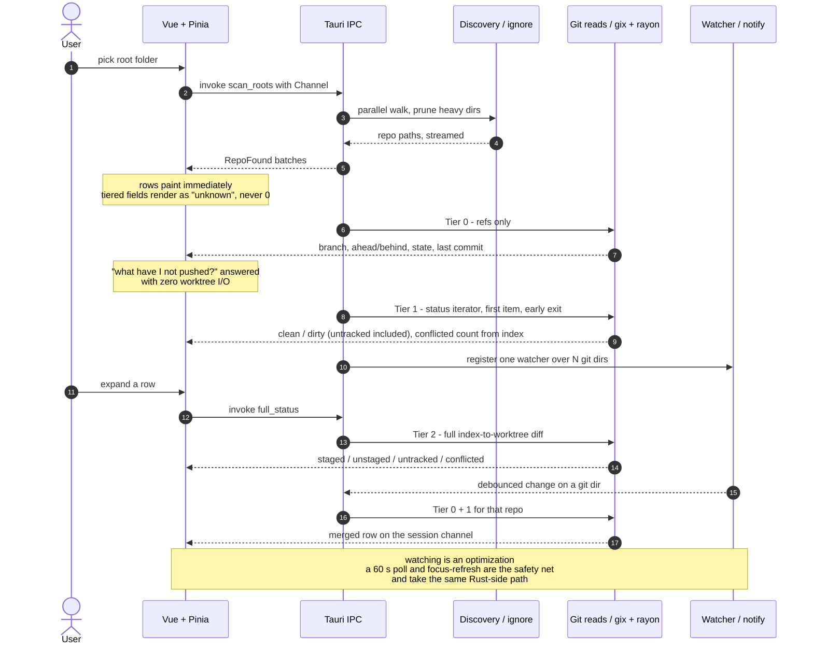

# AGENTS.md — `repo-viewer`

A Tauri 2 desktop app: Rust backend, Vue 3 frontend. Points at a folder, reports Git status for
every repo beneath it. See [README.md](./README.md) for orientation and commands;
**[PLAN.md](./PLAN.md) is the specification** — design decisions, roadmap, open questions. The
phase currently being executed has a runbook in `docs/`, linked from PLAN.md §11; start there
when picking up work.

This app also exists to prove Tauri + Vue as a delivery pattern for offline client apps against a
local SQL database. That is why the frontend stack matches `WPT.Dashboard` and why `src-tauri/`
stays thin: both must transfer.

## Commands

`vp` fronts everything — deps, scripts, tasks. **Never run `pnpm` / `npm` / `yarn` scripts
directly**; `vp install` / `vp add` / `vp remove` / `vp run` delegate through the pinned package
manager and preserve catalog overrides that ad-hoc calls corrupt. (CI uses `pnpm exec vp …` only
because `vp` is not global on an ADO agent — a pipeline detail, not a pattern to copy.)

| Need | Command |
|---|---|
| Dev, full app | `vp run dev` |
| Dev, frontend only | `vp dev` |
| Check everything (fmt, lint, `.ts` types) | `vp check` |
| Auto-fix | `vp check --fix` |
| Vue SFC type-check | `vp run typecheck` |
| Tests | `vp test run` |
| Build + installer | `vp run build`, then `vp run verify` asserts the bundle is a production build |
| Regenerate TS types | `vp run types` |
| Add a dependency | `vp add <pkg>` then pin it exact in the catalog |
| Bump a dependency | `vp update -L <pkg>` |
| Rust checks | `cargo fmt --check && cargo clippy --all-targets -- -D warnings && cargo test` |
| Engine without the GUI | `cargo run --release --example scan -- <path>` |
| Regenerate TS types | `cargo test --features typescript` |

Imports: configs from `vite-plus`, tests from `vite-plus/test`. **Never `vite` / `vitest`
direct** — `vite-plus/oxlint-plugin` enforces this.

## Architecture invariants

Break any of these and the design stops working. They are not style preferences.

- **`crates/repo-scan/` has no Tauri dependency.** All discovery, Git reads, watching, and fetch
  live there. `src-tauri/` is glue: commands, state, channel adaptation. If engine code needs a
  Tauri type, the boundary is in the wrong place.
- **`src/scripts/ipc.ts` is the only file that imports `@tauri-apps/api`, and no
  `@tauri-apps/plugin-*` package exists in the frontend.** Components and stores go through
  `ipc.ts`; dialog, opener, and store are reached through the app's own commands, from their
  Rust APIs. Keeps the IPC surface auditable, the capabilities file at `core:default`, and
  components testable with `mockIPC`.
- **The frontend does no Git logic, no path manipulation, and no filesystem access.** Rust owns
  all of it.
- **Rust owns the canonical row state.** `src-tauri/src/state.rs` holds the one
  `HashMap<PathBuf, RepoStatus>`, merges each tier into it, and sends the full merged row. The
  Pinia store is a mirror keyed by path: it never merges tiers and never holds a value Rust does
  not. Commands that take a path accept only a key of that map.
- **Everything streams over `tauri::ipc::Channel`; `emit()`/`listen()` are not used.** Tauri's
  event system is documented as "not designed for low latency or high throughput" — payloads are
  always JSON strings. One `Channel<ScanEvent>` per scan, one `Channel<RepoEvent>` per session
  opened by `subscribe` at startup for watcher, poll, and fetch pushes. Batch sends (~50 ms, or
  25 repos) rather than one per repo. Every scan event carries its `ScanId`; the frontend drops
  events from any scan it did not ask for.
- **One `notify` watcher for all repos.** `notify` spawns a thread per `Watcher`, so N watchers
  means N threads. Create one and call `watch()` per repo, non-recursively, on the git dir only.
- **Uncomputed tiers render as unknown, never as `0`.** Every tiered field is `Option`, and the UI
  must say "counting…" rather than showing a number it does not have. This is the most common bug
  in this class of app.

### The tiered scan

The reason the UI feels instant. A row appears before any worktree is touched.

Never move Tier 2 work into the default scan path. Tier 0 is refs-only and must stay that way.
A change notice never crosses IPC on its own: Rust refreshes and pushes the row.

## Hard rules

- **Every dependency version is exact**, declared once in `pnpm-workspace.yaml`'s `catalog:`
  (frontend) and `[workspace.dependencies]` in the root `Cargo.toml` (Rust). Bump deliberately
  with `vp update -L <pkg>`; never widen a range.
- **`typescript` stays at 6.0.3 until TypeScript 7.1 ships its programmatic API and `vue-tsc`
  runs on it.** `typescript@7.0.2` is `latest`, but its Go-native compiler exposes no stable API,
  so Volar and `vue-tsc` cannot use it and SFC type-checking breaks. `vue-tsc`'s peer range
  (`>=5.0.0`) will let you install the broken pair. Two checkers: `vue-tsc` on TS 6 for `.vue`,
  `tsgo` (from `@typescript/native-preview`) for plain `.ts`. `vp check` does **not** route Vue
  through `vue-tsc` — that is the `typecheck` task (`vp run typecheck`), which `build` depends
  on. Review the pin when 7.1 is released, not before; `vue-tsgo` is the interim bridge if it
  is needed sooner.
- **`vitest` stays at 4.1.11.** `vite-plus` 0.3.0 pins it and every `@vitest/*` internal to match.
  `vite` / `vite-plus` / `vitest` move in **lockstep**.
- **Node is 24, pinned in `engines` and `.node-version`.** pnpm enforces the `packageManager`
  field itself; corepack is not part of the setup and is not distributed with Node 25+.
- **`[profile.release]` lives in the root `Cargo.toml`.** Cargo ignores profile sections in member
  crates with only a warning, so a `src-tauri`-local block silently ships an unoptimized binary.
- **`panic = "unwind"` and `opt-level = 3` in that profile.** Per-repo work runs under
  `catch_unwind` so a `gix` panic on one corrupt repo becomes `RepoStatus.error`; `abort` would
  take the app down, and rayon propagates worker panics. Do not copy `panic = "abort"` /
  `opt-level = "s"` from Tauri's app-size guide.
- **`app.security.csp` is set in `tauri.conf.json`.** The default is `null`, which is no CSP.
- **`model.rs` types are `gix`-free and `ts-rs`-expressible.** Hex `String` for ids, `u64`
  epoch-ms for times (`ts-rs` has no `SystemTime` impl), `rename_all = "camelCase"`, internally
  tagged enums.
- **Keep `[lib] name = "..._lib"`** in `src-tauri/Cargo.toml`. The suffix prevents a lib/bin name
  collision on Windows specifically ([cargo#8519](https://github.com/rust-lang/cargo/issues/8519)).
- `/target/` is gitignored at the **repo root**, not under `src-tauri/` — the workspace moves it.
- **`edition = "2024"`** in every crate, not the Tauri template's 2021.
- `thiserror` for the engine's typed errors; `anyhow` only at the `src-tauri` edge. Per-repo
  failures are values on `RepoStatus.error`, never panics, and never fatal to a scan.
- `ts-rs` output in `src/scripts/generated/` is **committed** so the frontend builds without Rust.
  Regenerate with `cargo test --features typescript`; CI fails on a diff.
- Bash under Windows: forward slashes, `/dev/null` (not `NUL`).
- **Git is read-only for agents.** Prepare commands; do not commit, push, fetch, or pull.

## Code conventions

Carried over from `WPT.Dashboard` — keep them identical so lessons transfer.

- `function foo()` declarations, not `const foo = () =>`.
- JSDoc every export. (oxfmt's `jsdoc` plugin handles formatting; just write the description.)
- Vue `<script setup>` section order: Imports → Type → Setup → Data → Composed → Computed →
  Watchers → Methods → Lifecycle. A `/// Section` divider per section except Imports.
- Import order: packages → `@/` → `./`, alphabetical, no blank lines between groups.
- Alias `@/*` → `src/*`.
- **Use `App*` wrappers at call sites — never raw `reka-ui` primitives.** Add a wrapper if one is
  missing.
- Unit tests sit beside their subject (`RepoTable.vue` + `RepoTable.test.ts`). `src/tests/` holds
  only shared harness and setup.
- Custom palette only. Stock Tailwind hues are blanked (`--color-*: initial`), so `bg-slate-500`
  silently nulls. `--spacing: 1px`, so `p-20` is 20px and `text-14` is pixel-literal.
- Derive `Debug` on public Rust types; return a crate-local `Result<T>` alias from `error.rs`.

## Documentation rules

- **Docs describe the current design and how to build it.** No evolution narration — no "used
  to", "as of \<date\>", "changed on", "renamed from". History lives in git log.
- **Measured traps and operational gotchas are forward-facing and stay** — as present-tense
  facts, not war stories. That is what the section below is.
- When the design changes, update every affected doc in the same pass. A doc that narrates its
  own edit history is a defect.
- Code comments follow the same rule: rationale yes, changelog no.

## Durable failure shapes

Each of these has bitten. They are silent, which is why they are written down.

**Tauri's Vite guide has two wrong values.** They fail identically on plain Vite 8 and on
`vite-plus`, since vite-plus-core 0.3.0 *is* Vite 8.2.2:

- `build.minify: 'esbuild'` is deprecated in Vite 8 and slated for removal; Oxc is the minifier.
  Use `'oxc'`, or omit the key — `'oxc'` is the default.
- `envPrefix: ['VITE_', 'TAURI_ENV_*']` exposes nothing. `envPrefix` is a literal `startsWith`
  prefix, not a glob, so the trailing `*` matches no variable and
  `import.meta.env.TAURI_ENV_PLATFORM` is `undefined`. Use `'TAURI_ENV_'`. Config-side
  `process.env.TAURI_ENV_PLATFORM` works either way, which is exactly why it goes unnoticed.

**A production build needs `NODE_ENV=production` *and* `--mode production`.** The `vp` task runner
sets `NODE_ENV`, and Vite derives `isProduction` from it, overriding `--mode`. A bundle built via
`vp run build` has `import.meta.env.DEV` **true** and `PROD` **false**, inverting every env guard
silently. Tauri's `beforeBuildCommand` invokes commands directly rather than through `vp run`, so
specify `vp build --mode production` there — and assert the built bundle's `PROD` flag in a test.

**`.git` is often a file, not a directory.** Linked worktrees and submodules write a `.git` *file*
containing `gitdir: <path>`. `path.join(".git").is_dir()` silently misses both. Test existence,
then resolve. Bare repos have no `.git` at all — detect via `HEAD` + `objects/` + `refs/`.

**`gix::Repository::is_dirty()` ignores untracked files.** Its docs say so, and it disables the
directory walk internally. A repo whose only change is a new file reports clean. The dirty flag
comes from the status iterator with `untracked_files(Collapsed)`, first item, `should_interrupt`.

**`gix`'s `with_boundary` is not `^rev`.** It stops the walk at the given commits but does not
hide their ancestors, so ahead/behind over any merged history overcounts. Use `with_hidden`,
which the docs equate to `^branch-to-not-list`, and cap the walk — disjoint histories can make
it visit everything.

**A non-recursive watch on `.git/refs/` misses most ref updates.** It sees only direct children,
so `refs/heads/feature/x` and every `refs/remotes/origin/*` update are invisible. Watch `refs/`
recursively (it is tiny), the git-dir root non-recursively, and `logs/HEAD`.

**Windows long paths bite on the way out, not in.** `std::fs` already applies the `\\?\` prefix
for long paths, so the walk does not fail on deep `node_modules`. `canonicalize()` *returns*
`\\?\C:\...` paths, which render badly, confuse `git` CLI arguments, and compare unequal to the
typed form. Canonicalize through `dunce`. Junctions and reparse points are reported as symlinks
by `std`, so `follow_links(false)` covers them.

**A spawned `git` flashes a console window on Windows.** Every `Command` for `git fetch` sets
`creation_flags(CREATE_NO_WINDOW)` and `GIT_TERMINAL_PROMPT=0`, and has a timeout — a credential
or SSH prompt with no terminal otherwise hangs the process forever.

**Defender for Endpoint on CIT-managed machines blocks unsigned executables.** It denies
execution of freshly downloaded, low-prevalence binaries with `os error 5` even when ACLs are
correct, before SmartScreen is ever involved. An unsigned installer cannot be clicked through;
signing or an IT allow indicator is a prerequisite for distributing to colleagues.

**Git writes `.git/index` three times per operation.** It writes `index.lock`, writes, then
renames, so one `git add` produces a create/modify/remove burst. Debouncing
(`notify-debouncer-full`, ~300–500 ms, plus a per-repo cooldown) is mandatory, not an
optimization. Never let a watcher callback block: if it stalls, OS events pile up in the kernel
buffer and are dropped on overflow.

**Watching is never the source of truth.** `notify`'s own docs warn it "may fail to receive all
events" at high file counts. Linux inotify has a per-user watch limit that surfaces as "No space
left on device" — detect that specific error and print the `sysctl` fix rather than failing
opaquely. Always ship the ~60 s poll and refresh-on-focus.

**Ahead/behind is relative to the last fetch, not the remote.** It is measured against
`refs/remotes/origin/*`. Never present it without the `last_fetched` age beside it.

## External docs — fetch, do not guess

`gix` is pre-1.0 and its API churns on minor bumps; `vite-plus` is 0.3.x; Tauri plugins move
independently of the core. Look up the current signature rather than recalling one. The pinned
versions are in [PLAN.md §3](./PLAN.md), and its References section lists the primary sources.
