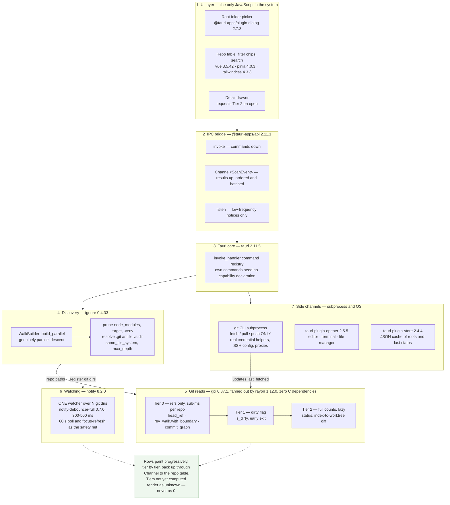
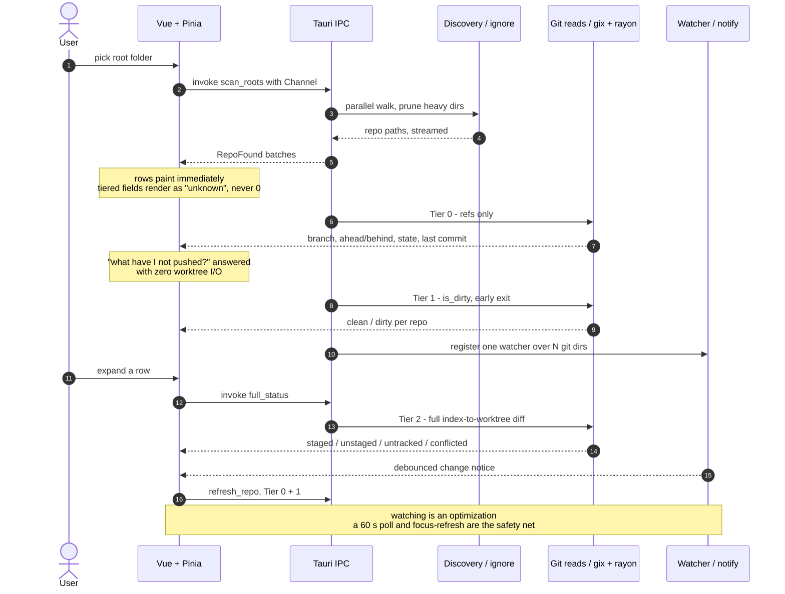

# repo-viewer

A cross-platform desktop app: point it at a folder and get a live dashboard of every Git repo
beneath it — branch, ahead/behind, dirty state, file counts — without opening each one in an IDE.

Status: **planning.** No code yet.

---

## 1. What this is

### 1.1 Two goals

1. **The tool.** A multi-repo Git dashboard for personal use, shared with colleagues at CIT who
   want it.
2. **A delivery pattern.** Establish whether Vue/web skill transfers to shipping a desktop app to
   a smaller client — a site that cannot run a web server, or has connectivity too poor to rely
   on, but needs an intranet-style app against a **local SQL database**.

Goal 2 drives most of what follows. It is why the frontend stack matches WPT.Dashboard rather
than being chosen fresh, and why the code is split so the Tauri-specific parts stay thin. It is
also why repo-viewer is a good first subject: it exercises the whole Tauri↔Vue boundary while
having no database, isolating the mechanics from data-access concerns. The appendix records what
changes once SQL is added.

### 1.2 Scope for v1

**Read-only, plus batch fetch.** The app reports state and launches external tools; it does not
stage, commit, or push. Fetch is included because ahead/behind is meaningless without it (§8.2).

In scope: recursive discovery, tiered status, filtering and search, live refresh, opt-in fetch,
open-in-editor/terminal/file-manager, Windows installer.

Out of scope: mutating Git operations, mobile, multi-window, remote/API repos.

---

## 2. Architecture

### 2.1 Responsibility split

```
Vue 3 + Pinia (src/) ............ presentation only
  - repo table: sort, filter, group, search
  - filter chips: dirty | unpushed | detached | conflicted | stale-fetch
  - per-repo detail drawer (triggers Tier 2 on open)
  - scan progress, staleness badges, action buttons
  - NO git logic, NO path manipulation, NO filesystem access

IPC (@tauri-apps/api) ...........
  invoke()      -> commands (scan, refresh, fetch, open, reveal)
  Channel<T>    -> streamed scan results and progress
  listen()      -> low-frequency watcher notifications

Rust (crates/ + src-tauri/) ..... all system work
  - parallel discovery
  - tiered Git reads
  - filesystem watching and debounce
  - `git` CLI subprocess for fetch/pull/push only
  - path normalization, editor/terminal/file-manager launch
  - JSON cache read/write
```

The boundary is structural, not aspirational: `src/` cannot import the engine, because one is
TypeScript and the other a Rust crate.

### 2.2 The scan is tiered

Most of what the dashboard shows costs almost nothing; only file counts are expensive. Three
tiers stream independently, so a row appears before any worktree is touched.

| Tier | Cost per repo | Yields | When |
|---|---|---|---|
| **0 — refs only** | sub-millisecond; reads `.git/HEAD`, `packed-refs`, loose refs, revwalk with commit-graph | branch, ahead/behind, upstream, stash count, state flags (rebase/merge/bisect/detached), last commit | immediately, every scan |
| **1 — dirty flag** | early-exit via `is_dirty()` | clean/dirty boolean | streams in right after Tier 0 |
| **2 — full counts** | full index↔worktree diff | staged / unstaged / untracked / conflicted | lazily: visible rows, expanded rows, explicit refresh |

Tier 0 alone answers "which repos have unpushed commits?" with zero worktree I/O. This tiering
matters more to perceived performance than any library choice.

### 2.3 Layers and libraries

Layers 1–2 are the only JavaScript; layer 3 down is Rust. The upward return path is in §2.4.



### 2.4 A scan, end to end



---

## 3. Stack

### 3.1 Rust backend (`crates/`, `src-tauri/`)

| Crate | Version | Role |
|---|---|---|
| `tauri` | 2.11.5 | shell, windowing, IPC |
| `gix` | 0.87.1 | all Git reads — **default features only**, no network/TLS features (§11.3) |
| `ignore` | 0.4.33 | parallel repo discovery |
| `rayon` | 1.12.0 | per-repo fan-out |
| `notify` | 8.2.0 | filesystem watching |
| `notify-debouncer-full` | 0.7.0 | debounce — mandatory (§7.3) |
| `tokio` | 1.53.1 | async runtime for Tauri commands |
| `serde` / `serde_json` | 1.x / 1.0.151 | IPC payloads |
| `thiserror` | 2.0.20 | engine errors |
| `anyhow` | 1.0.104 | `src-tauri` layer only |
| `tracing` / `tracing-subscriber` | 0.1.44 / 0.3.23 | scan timings |
| `ts-rs` | 12.0.1 | TypeScript type generation (§4.4) |
| `tempfile` / `assert_fs` | 3.27.0 / 1.1.4 | dev-only, test fixtures |
| `tauri-plugin-dialog` | 2.7.3 | native folder picker |
| `tauri-plugin-store` | 2.4.4 | JSON cache |
| `tauri-plugin-opener` | 2.5.5 | reveal in Explorer/Finder, open in editor |
| `tauri-plugin-window-state` | 2.4.1 | window geometry |

**`gix`, not `git2`, on the read path.** The app's premise is scanning hundreds of repos and
feeling instant, and libgit2 is the slower option per repository: `git_status_list_new` runs
~2.5× slower than `git status` without the untracked cache and ~5–6× slower with it
([libgit2#4230](https://github.com/libgit2/libgit2/issues/4230)), ~3 s vs ~0.1 s on the `rust`
repo ([exa#28](https://github.com/ogham/exa/issues/28)). It also has no early-exit, so "is this
repo dirty?" costs a full diff. `gix` provides `Repository::is_dirty()`, exactly the primitive a
dashboard needs, and `gix-credentials` invokes real `git credential` helpers.

Two `gix` gaps and their handling:

- **No `ahead_behind` API.** Compute it with `rev_walk([local]).with_boundary([upstream])`,
  counted, then the same with arguments swapped. Isolated in one file so it is easy to swap.
- **Pre-1.0, breaks on minor bumps** ([gix#470](https://github.com/GitoxideLabs/gitoxide/issues/470)).
  Pin exact and treat upgrades as tasks. Keep reads behind a small `GitBackend` trait so `git2`
  can be dropped in per-operation — keep the seam, do not build two backends.

**In-process reads, not subprocess.** Windows process creation is >20× slower than Linux and
acutely sensitive to Defender and corporate AV
([benchmark](https://www.bitsnbites.eu/benchmarking-os-primitives/)). Spawning 300 `git status`
processes on the primary dev machine is the worst available option. Fetch is the exception
(§8.2) — it is network-bound, so process cost is noise.

**Parallel discovery uses `ignore`, not `walkdir`.** `walkdir` is a sequential iterator; rayon
can parallelize work on the entries it yields but not the directory *descent*, which is the
bottleneck. `ignore::WalkBuilder::build_parallel()` (the crate behind ripgrep) gives a genuinely
parallel walk with a prune predicate. `jwalk` 0.9.0 is the fallback if `ignore`'s gitignore
machinery gets in the way.

**Storage is JSON, not SQLite.** Hundreds of small flat records, no relational queries, no
history, no concurrent writers. `tauri-plugin-store` covers it. Revisit only if commit-history
or time-series features land.

### 3.2 Frontend (`src/`)

The WPT.Dashboard stack at latest versions. Greenfield has no migration cost, so this repo runs
ahead of that catalog and serves as the proving ground for bumps later applied there.

| Package | Version | Notes |
|---|---|---|
| `vite-plus` | 0.3.0 | the toolchain: Vite + Vitest + oxlint + oxfmt + task runner, one pinned bundle |
| `vite` | `npm:@voidzero-dev/vite-plus-core@0.3.0` | is Vite 8.2.2 — i.e. plain-Vite latest |
| `vitest` | **4.1.11 — not 5.0.0** | lockstep (§3.3) |
| `vue` | 3.5.42 | latest stable; 3.6 is at rc.7 |
| `vue-router` | 5.3.1 | file-based routing via `vue-router/vite` |
| `pinia` | 4.0.3 | ESM-only |
| `@vue/devtools-api` | 8.2.1 | required peer of pinia 4 (`^8.1.5`); no longer bundled |
| `reka-ui` | 2.10.4 | headless primitives, wrapped as `App*` |
| `@vueuse/core` | 14.4.0 | |
| `@vitejs/plugin-vue` | 6.0.8 | |
| `tailwindcss` + `@tailwindcss/vite` | 4.3.3 | CSS-first; custom palette, `--spacing: 1px` |
| `typescript` | **6.0.3 — not 7.0.2** | see §3.3 |
| `@typescript/native-preview` | 7.0.0-dev.20260707.2 | `tsgo`, non-SFC TypeScript only |
| `vue-tsc` | 3.3.11 | |
| `minisearch` | 7.2.0 | repo search (§8.3) |
| `zod` | 4.5.4 | validates the persisted settings/cache shape |
| `@iconify-json/bi` + `bootstrap-icons` | 1.2.7 / 1.13.1 | |
| `@vue/test-utils` / `jsdom` | 2.5.0 / 30.0.1 | |
| `@tauri-apps/api` | 2.11.1 | |
| `@tauri-apps/cli` | 2.11.4 | |
| `@tauri-apps/plugin-dialog` / `-store` / `-opener` | 2.7.3 / 2.4.4 / 2.5.5 | |

`oxlint` 1.79.0, `oxfmt` 0.64.0, `oxlint-tsgolint` 7.0.2001 and `tsdown` 0.22.14 arrive inside
`vite-plus` — do not add them as catalog entries.

**Every version exact, declared once** in the root `pnpm-workspace.yaml` `catalog:` block.
Catalogs are a pnpm-workspace feature, so that file exists even though this is a single package.
Bump with `vp update -L <pkg>`, never by widening a range.

**Virtualization is deferred.** 500 rows of simple DOM does not need it, and it costs real
complexity in measurement, sticky headers, keyboard nav, and find-in-page. Keep row markup
fixed-height, measure, and add `@tanstack/vue-virtual` 3.13.36 past a measured threshold
(~1000 rows, or a p95 frame-budget miss).

### 3.3 Constraints that are load-bearing

**`typescript` must be 6.0.3.** TS 7's Go-native compiler ships without a stable programmatic
API, so Volar and `vue-tsc` cannot use it and SFC type-checking breaks. `vue-tsc`'s peer range
(`>=5.0.0`) will happily install the broken pair. The arrangement is **two checkers**: `vue-tsc`
on TS 6 for `.vue`, `tsgo` for plain `.ts`. `vp check` does not route Vue through `vue-tsc` —
wire it explicitly in the `check` task. Revisit at TS 7.1 (~Oct 2026).

**`vitest` must be 4.1.11.** `vite-plus` 0.3.0 pins `vitest@4.1.11` and every `@vitest/*`
internal to match. Breaking the lockstep fails as a resolution error in a transitive dependency,
which reads like an unrelated upstream problem — pnpm does not re-resolve the `vite` npm-alias on
a range bump.

**Two values in Tauri's Vite guide are wrong on Vite 8** and must be corrected in
`vite.config.ts`. They apply equally to plain Vite 8 and `vite-plus`, since vite-plus-core 0.3.0
is Vite 8.2.2:

1. `build.minify: 'esbuild'` hard-fails — Vite 8 dropped esbuild for Oxc, and the error is
   *"Failed to load `transformWithEsbuild`… migrate to `transformWithOxc`."* Use **`'oxc'`**.
2. `envPrefix: ['VITE_', 'TAURI_ENV_*']` exposes nothing. `envPrefix` is a literal `startsWith`
   prefix, not a glob, so the trailing `*` matches no variable and
   `import.meta.env.TAURI_ENV_PLATFORM` is `undefined`. Use **`'TAURI_ENV_'`**. Config-side
   `process.env.TAURI_ENV_PLATFORM` works either way, which is why this goes unnoticed.

**Production builds need `NODE_ENV=production` *and* `--mode production`.** The `vp` task runner
sets `NODE_ENV`, and Vite derives `isProduction` from it, overriding `--mode` — a bundle built
through `vp run build` has `import.meta.env.DEV` **true** and `PROD` **false**, silently
inverting every env guard. Tauri's `beforeBuildCommand` invokes commands directly rather than
through `vp run`, so specify `vp build --mode production` there and assert the built bundle's
`PROD` flag in a test.

**Tauri interop contract.** `vp dev` serves on `server.port` with `strictPort: true` and injects
`/@vite/client`, satisfying `devUrl`; `vp build` emits `dist/`, satisfying `frontendDist`.
`defineConfig` from `vite-plus` passes through every Vite key Tauri needs: `clearScreen`,
`server.host/port/strictPort/hmr`, `server.watch.ignored`, `envPrefix`,
`build.target/minify/sourcemap`.

---

## 4. Project structure

### 4.1 There is no solution file

| .NET habit | Here |
|---|---|
| `.sln` | root **`Cargo.toml`** — the `[workspace]` manifest |
| `.csproj` | one **`Cargo.toml`** per crate |
| NuGet `packages.config` | `Cargo.toml` `[dependencies]` + `Cargo.lock` |
| — | root **`package.json`** + `pnpm-workspace.yaml` |

Visual Studio has weak Rust support; work in **VS Code with rust-analyzer** (or RustRover).

### 4.2 Layout

Tauri convention is a flat root with `src/` and `src-tauri/`, and this is one frontend package,
so there is no `apps/`/`packages/` split. Inside `src/`, layout and naming follow the
WPT.Dashboard house rules.

```
repo-viewer/
├── Cargo.toml                    # [workspace] + [workspace.dependencies]
├── Cargo.lock                    # committed (application, not library)
├── package.json                  # one package; vp fronts every command
├── pnpm-workspace.yaml           # catalog: only — every version exact, declared once
├── pnpm-lock.yaml
├── vite.config.ts                # vp config: vite + test + lint + fmt + run.tasks
├── tsconfig.json / tsconfig.base.json
├── index.html
├── .taurignore                   # keeps `tauri dev` from rebuilding on frontend churn
├── azure-pipelines.yml
├── PLAN.md
├── CLAUDE.md                     # conventions, layered like WPT.Dashboard's
│
├── src/                          # ── Vue frontend
│   ├── main.ts
│   ├── route-map.d.ts            # generated by VueRouter({ dts }) — committed
│   ├── layout/
│   │   ├── App.vue               # shell (App.vue lives here, not src root)
│   │   └── Header.vue
│   ├── pages/                    # file-based routes; index.vue = /
│   │   ├── index.vue             # the dashboard
│   │   └── settings.vue          # roots, prune list, thresholds
│   ├── components/
│   │   ├── inputs/               # App*.vue reka-ui wrappers — ALWAYS use at call sites
│   │   │   ├── AppDialog.vue
│   │   │   ├── AppCheckbox.vue
│   │   │   ├── AppDropdownlist.vue
│   │   │   └── AppContextMenu.vue      # row right-click: open in editor / terminal
│   │   ├── repos/                # domain components, unprefixed
│   │   │   ├── RepoTable.vue     # fixed-height rows (§3.2)
│   │   │   ├── RepoTable.test.ts #   tests colocated, never a mirror tree
│   │   │   ├── RepoRow.vue
│   │   │   ├── FilterBar.vue
│   │   │   ├── DetailDrawer.vue  # triggers Tier 2 on open
│   │   │   └── StalenessBadge.vue      # last_fetched age (§8.2)
│   │   └── feedback/
│   │       ├── AppToaster.vue
│   │       └── ScanProgress.vue
│   ├── scripts/                  # plumbing — the house home for data access
│   │   ├── ipc.ts                # the ONLY place @tauri-apps/api is imported
│   │   ├── scan.ts               # Channel<ScanEvent> subscription + batching
│   │   ├── search.ts             # MiniSearch index over the live repo set (§8.3)
│   │   ├── router.ts             # guard only
│   │   ├── utils.ts              # useLS etc.
│   │   └── generated/            # ts-rs output, committed (§4.4)
│   ├── stores/                   # Pinia, one file per store + colocated test
│   │   ├── repos.ts
│   │   ├── filters.ts
│   │   └── settings.ts
│   ├── styles/
│   │   ├── main.css
│   │   └── theme.css             # custom palette; stock Tailwind hues blanked
│   ├── tests/
│   │   └── setup.ts              # shared harness only
│   └── types/
│       └── ipc.d.ts              # ambient only
│
├── crates/
│   └── repo-scan/                # ── THE ENGINE. Zero Tauri dependency.
│       ├── Cargo.toml
│       ├── examples/
│       │   └── scan.rs           # `cargo run --release --example scan -- <path>` (§4.6)
│       ├── src/
│       │   ├── lib.rs
│       │   ├── model.rs          # RepoStatus, Tier, Head, FileCounts (§8.1)
│       │   ├── error.rs          # thiserror — per-repo errors are values, not panics
│       │   ├── discover/
│       │   │   ├── mod.rs        # ignore::WalkBuilder::build_parallel
│       │   │   ├── prune.rs      # node_modules, target, .venv … user-extensible
│       │   │   └── gitdir.rs     # .git file vs dir, bare, worktree, submodule (§5.2)
│       │   ├── status/
│       │   │   ├── mod.rs
│       │   │   ├── tier0.rs      # refs, upstream, stash, state flags
│       │   │   ├── tier1.rs      # is_dirty, early exit
│       │   │   ├── tier2.rs      # full index-to-worktree counts
│       │   │   └── ahead_behind.rs   # rev_walk + with_boundary; isolated (§3.1)
│       │   ├── watch/
│       │   │   └── mod.rs        # ONE notify watcher + debouncer + poll fallback
│       │   └── fetch.rs          # git CLI subprocess (§8.2)
│       └── tests/
│           ├── discovery.rs
│           ├── status.rs
│           └── support/
│               └── fixtures.rs   # BUILDS repos into a TempDir (§4.5)
│
└── src-tauri/                    # ── THIN shell. Tauri-specific glue only.
    ├── Cargo.toml
    ├── tauri.conf.json
    ├── build.rs
    ├── capabilities/default.json # dialog, store, opener — NOT our own commands (§6.1)
    ├── icons/
    ├── gen/schemas/              # generated, gitignored
    └── src/
        ├── main.rs               # calls app_lib::run()
        ├── lib.rs                # run(): builder, plugins, state, invoke_handler
        ├── state.rs              # AppState: roots, cache, watcher handle
        ├── stream.rs             # domain events → tauri::ipc::Channel (§6.2)
        └── commands/
            ├── mod.rs
            ├── scan.rs           # scan_roots, refresh_repo
            ├── repo.rs           # full_status
            ├── fetch.rs          # fetch_repos
            └── config.rs         # add_root / remove_root / list_roots
```

Alias `@/*` → `src/*`. House code rules carry over: `function foo()` declarations rather than
`const foo = () =>`; JSDoc on every export; `<script setup>` section order (Imports → Type →
Setup → Data → Composed → Computed → Watchers → Methods → Lifecycle) with `/// Section`
dividers; import order packages → `@/` → `./`, alphabetical, no blank lines between groups.

### 4.3 The workspace, and three rules it imposes

The engine is a separate crate so `cargo test` and timing runs work without booting a webview,
and so the §2.1 boundary is compile-enforced. `tauri dev` watches `src-tauri` *and its dependent
workspace crates*, so editing `repo-scan` still triggers a rebuild.

1. **`[profile.release]` must live in the root `Cargo.toml`.** Cargo ignores profile sections in
   member crates with only a warning, so the Tauri template's
   `lto`/`codegen-units = 1`/`panic = "abort"`/`strip` block belongs at the root or the binary
   ships unoptimized and large.
2. **`target/` is at the workspace root.** The template's `src-tauri/.gitignore` entry for
   `/target/` stops matching; add `/target/` at the repo root.
3. **Keep `[lib] name = "..._lib"`** in `src-tauri/Cargo.toml`. The suffix prevents a lib/bin
   name collision **on Windows specifically**
   ([cargo#8519](https://github.com/rust-lang/cargo/issues/8519)).

### 4.4 Rust ↔ TypeScript type sync

Generate the types. Hand-maintained mirrors of `RepoStatus` drift, and the bug drift produces is
precisely the one §8.1 exists to prevent: an uncomputed tier rendering as `0` instead of unknown.

`ts-rs` 12.0.1 behind an optional `typescript` feature on `repo-scan`, deriving `TS` on the
`model.rs` types. `cargo test --features typescript` writes `src/scripts/generated/`, which is
**committed** so the frontend builds without a Rust toolchain. CI regenerates and fails on a
diff, which is what actually prevents drift.

`tauri-specta` would additionally type the command bindings but couples the engine to Tauri and
has roughly a tenth of the adoption. The handful of command signatures in `src/scripts/ipc.ts`
are cheap to hand-write and rarely change.

### 4.5 Tests and fixtures

Tests sit next to their subject (`RepoTable.vue` + `RepoTable.test.ts`); `src/tests/` holds only
shared harness and setup.

A nested `.git` cannot be committed inside the outer repo, and the cases most worth testing — a
linked worktree, a submodule, a bare repo (§5.2) — are exactly the ones needing real git
metadata. So `tests/support/fixtures.rs` builds the tree at test time into a `tempfile::TempDir`
by shelling out to `git`, and nothing under `tests/fixtures/` is committed.

**No `criterion`.** Its repeated-sampling model is the wrong shape for a whole-tree scan — 100
samples of a multi-second operation is a five-minute run fought with `sample_size`. The Phase 2
deliverable is one recorded number, which is `std::time::Instant` in the example below. Reach for
`criterion` later for micro-level pieces (`ahead_behind` on one repo, the prune predicate) if
they profile hot.

### 4.6 Running the engine without the GUI

`crates/repo-scan/examples/scan.rs`, run as
`cargo run --release --example scan -- C:/Working/Source`. Cargo compiles `examples/` during
`cargo test`, so it cannot rot, and it needs no extra crate, manifest, or `clap`. That covers
producing the timing number, debugging one repo without a webview in the way, and checking
behaviour in a CI container. Promote to `crates/repo-scan-cli/` with `clap` only once it wants
subcommands and flags.

### 4.7 Rust conventions

- **`edition = "2024"`**, not the Tauri template's 2021. Stabilized in Rust 1.85, and `gix`
  already forces MSRV 1.85.
- **`[workspace.dependencies]` in the root manifest**, members writing `gix.workspace = true` —
  the Cargo analogue of the pnpm catalog, so one policy covers both halves of the repo.
- **`cargo fmt --check` and `cargo clippy --all-targets -- -D warnings`** in CI from the first
  commit.
- `thiserror` for the engine's typed errors, `anyhow` only at the `src-tauri` edge.
- Derive `Debug` on public types; return a crate-local `Result<T>` alias from `error.rs`.

### 4.8 How this maps onto WPT.Dashboard

| WPT.Dashboard | repo-viewer |
|---|---|
| `apps/ui` — Vue SPA | `src/` — same stack, same conventions |
| OData over HTTP, `credentials: 'include'` | `invoke()` + `Channel<T>` (§6) |
| `apps/api` — Functions handlers, `ok()` / `errorResponse()` | `src-tauri/src/commands/` — `#[tauri::command]` |
| `packages/db` — data access via `mssql` | `crates/repo-scan/` — the domain engine |
| `packages/shared` — contracts, zod | `ts-rs`-generated types (§4.4) |
| SWA auth, `allowedRoles` | none — the OS user is the user |
| Azure Static Web App | an installer (§10) |

---

## 5. Repo discovery

### 5.1 Algorithm

Parallel walk from each configured root via `ignore::WalkBuilder`:

- `git_ignore(false)`, `hidden(false)`, `standard_filters(false)` — this walk must *see* ignored
  and hidden directories in order to prune them; it is not a content search.
- `filter_entry` prunes by name: `node_modules`, `target`, `.venv`, `venv`, `__pycache__`,
  `dist`, `build`, `.next`, `.nuxt`, `.gradle`, `vendor`, `bin`, `obj`, `Pods`, `.terraform`,
  `.build`. User-extensible.
- `same_file_system(true)` by default — avoids network shares and mounted volumes, a common
  cause of multi-minute scans.
- `follow_links(false)` by default — symlink loops are real.
- `max_depth` configurable, default 8.
- On finding a repo, record it and **stop descending** by default (config flag to continue).
  Submodules are enumerated from the parent's config rather than by walking.

### 5.2 Cases that must be handled

These are what make naive implementations wrong:

- **`.git` is often a file, not a directory.** Linked worktrees and submodules write a `.git`
  *file* containing `gitdir: <path>`. Testing `path.join(".git").is_dir()` silently misses both.
  Test for existence, then resolve.
- **Bare repos** have no `.git` — detect via `HEAD` + `objects/` + `refs/` at the root. List
  them flagged, with no worktree status.
- **Linked worktrees** share one object store. Each is its own row with its own HEAD and index,
  but must not be double-counted as separate repos.
- **Windows long paths.** Use `PathBuf` throughout, and enable long-path support (`\\?\`
  prefixing / the app manifest) — deep `node_modules` trees exceed `MAX_PATH` and the walk errors
  out mid-scan. Junctions and reparse points need the same treatment as symlinks.
- **Case sensitivity.** macOS is case-insensitive-preserving, Linux sensitive, Windows
  insensitive. Canonicalize for deduplication, display the on-disk form.
- **Permission errors** are collected and surfaced as a scan summary, never fatal to a scan.

---

## 6. IPC

### 6.1 Commands

```rust
scan_roots(roots: Vec<PathBuf>, opts: ScanOpts, on_event: Channel<ScanEvent>)
refresh_repo(path: PathBuf, tier: Tier) -> RepoStatus
full_status(path: PathBuf) -> DetailedStatus      // Tier 2, on demand
fetch_repos(paths: Vec<PathBuf>, on_event: Channel<FetchEvent>)   // git CLI
open_in(path: PathBuf, target: OpenTarget)        // editor | terminal | file manager
add_root(path) / remove_root(path) / list_roots()
```

Commands registered via `invoke_handler` are callable by all windows by default and need no
capability declaration. Only the *plugins* (`dialog`, `store`, `opener`) need entries in
`src-tauri/capabilities/`. Filesystem work inside our own commands is not constrained by the `fs`
plugin scope — the Rust side is trusted — which is why all fs access stays in Rust and
`tauri-plugin-fs` is not used.

### 6.2 `Channel<T>` for scan results, not events

Tauri's event system is explicitly "not designed for low latency or high throughput situations":
payloads are always JSON strings, unsuitable for larger messages. `tauri::ipc::Channel` is
"designed to be fast and deliver ordered data" and is what Tauri uses internally for streaming. A
scan emitting hundreds of tiered updates is the channel use case. Reserve `emit()` for infrequent
one-off notifications.

Batch channel sends — flush every ~50 ms or every 25 repos — rather than one send per repo. The
per-message JSON serialization cost is what bites.

---

## 7. Live updates

### 7.1 One watcher, many paths

`notify` spawns a thread per `Watcher` object, so 300 watchers means 300 threads. Create **one**
`recommended_watcher()` and call `watch()` once per repo.

### 7.2 What to watch

Non-recursive watches on each repo's git dir:

- `.git/HEAD` — branch switch / detach
- `.git/index` — staging changes
- `.git/refs/` and `.git/packed-refs` — commits, fetches, ref updates

Non-recursive is deliberate: recursively watching worktrees means watching `node_modules`, which
is how tools burn CPU and blow past inotify limits. The worktree itself is not watched — edits
are picked up by the debounced Tier 1/2 refresh or on window focus.

### 7.3 Debouncing is mandatory

Git does not write `.git/index` once; it writes `index.lock`, writes, then renames, so a single
`git add` produces a create/modify/remove burst. `notify-debouncer-full` with a ~300–500 ms
window plus a per-repo refresh cooldown is required to avoid a refresh storm. Never let a watcher
callback block: if it stalls, OS events pile up in the kernel buffer and are silently dropped on
overflow.

### 7.4 Watching is an optimization, never the source of truth

- **Linux:** inotify has a per-user watch limit; exceeding it surfaces as "No space left on
  device". Detect that specific error and surface actionable guidance
  (`sysctl fs.inotify.max_user_watches=524288`) rather than failing opaquely.
- **macOS:** FSEvents cannot observe files the process does not own; Docker on Apple Silicon
  returns `os error 38`.
- **All platforms:** `notify`'s own docs warn it "may fail to receive all events" at high file
  counts, and that backends are "not a 100% reliable source".

So always ship a low-frequency poll (Tier 0 every ~60 s, configurable) and a refresh-on-focus,
with `PollWatcher` available as a manual fallback for network mounts and containers.

---

## 8. Data, fetch, and search

### 8.1 Model

```rust
struct RepoStatus {
    path: PathBuf,
    name: String,
    kind: RepoKind,              // Normal | Bare | LinkedWorktree | Submodule

    // Tier 0
    head: Head,                  // Branch(String) | Detached(ObjectId) | Unborn
    upstream: Option<String>,
    ahead: Option<u32>,          // None = no upstream configured
    behind: Option<u32>,
    last_commit: Option<CommitSummary>,
    stash_count: u32,
    state: RepoState,            // Clean | Merging | Rebasing | Bisecting | CherryPicking
    last_fetched: Option<SystemTime>,   // drives the staleness badge (§8.2)

    // Tier 1
    dirty: Option<bool>,         // None = not yet computed

    // Tier 2
    counts: Option<FileCounts>,  // staged, unstaged, untracked, conflicted
    submodules: Vec<SubmoduleStatus>,

    scanned_at: SystemTime,
    error: Option<String>,       // per-repo failure, never fatal to the scan
}
```

`Option` on every tiered field is load-bearing: the UI must render a partial row honestly
("counting…") rather than showing `0` for "unknown". That is the most common bug in this class of
app.

Persisted to the JSON store so launch paints last-known state immediately, then reconciles. Every
cached row renders with its `scanned_at` age until refreshed.

### 8.2 Ahead/behind is relative to the last fetch

Ahead/behind is measured against the local remote-tracking ref (`refs/remotes/origin/*`), which
is only as fresh as the last `git fetch`. An app whose selling point is "what haven't I pushed?"
is misleading if it shows stale numbers silently. So:

- Show a per-repo **"last fetched"** timestamp and visually degrade rows past a threshold.
- Fetching is explicit, opt-in, and rate-limited — never part of a scan, and never on launch.
  Fetching 300 repos unprompted is hostile.
- **Fetch via the `git` CLI.** Fetch is where credential helpers, SSH config (`~/.ssh/config`,
  agents, jump hosts), corporate proxies, and custom transports matter, and where getting it
  wrong means hanging on a credential prompt with no UI. This is also why `keyring` is not
  needed: delegate to the credential helper already installed (Git Credential Manager on
  Windows, Keychain on macOS).

### 8.3 Search

`minisearch` 7.2.0. CIT Quickwire's `qdocs` runs it in production
(`src/composables/useSearch.ts`); the tuning below is borrowed from there.

1. **`shallowRef`, never `ref`, for the instance.** The index is a large nested structure; deep
   reactivity over it is a performance disaster.
2. **Module-scoped singleton.** Instance and UI state (`open`, `query`, `selectedIndex`) at
   module scope; the composable returns handles. One index, shared.
3. **`fields` vs `storeFields` are different lists.** `fields` is searched; `storeFields` is what
   comes back — set it and results are flat (`r.slug`), unset and you dig through `r.obj.*`.
4. **Length-conditional fuzziness:** `fuzzy: (term) => term.length >= 5 ? 0.2 : false`, plus
   `prefix: true`. Exact-only under 5 characters matters more here than in docs, since repo names
   are full of short fragments (`api`, `db`, `ui`, `ssg`).
5. **AND first, OR as fallback.** Search `combineWith: 'AND'`; if empty, re-run with `'OR'`.

Also carry `boost` for field weighting (repo name over its path), `MIN_QUERY_LENGTH = 2`, and
`results` as a `computed` over `query`.

**The corpus is live, not static.** qdocs fetches a prebuilt index once; here the corpus *is* the
repo set, streaming in tier by tier and mutating on watcher events. So build from the Pinia store
with no `fetch` and no build-time artifact; `add` on `RepoFound` batches and **`replace(doc)`**
when a row changes. MiniSearch 7 has the full incremental surface — `add`, `addAll`,
`addAllAsync`, `remove`, `removeAll`, `replace`, `discard`, `discardAll`, `vacuum`, `has`,
`getStoredFields`, `search`, `autoSuggest`, plus `toJSON` / static `loadJSON`. Prefer `discard`
over `remove` and let auto-vacuum reclaim; do not rebuild on every change.

Index only stable, cheap fields — repo name, path, branch, upstream. Never Tier 2 counts: they
are lazy and mostly unknown, so indexing them means reindexing on every tier completion for no
search value.

Do not add an `optimizeDeps.include` entry for it. qdocs needs one because `minisearch` is
reached *through* a library excluded from pre-bundling; here it is a direct dependency imported
from `src/`, so Vite's initial scan pre-bundles it with no configuration.

---

## 9. Build environment

### 9.1 State of this machine

| | Needed for | Status |
|---|---|---|
| Node.js + pnpm | the frontend | ✅ Node 22.21.1, pnpm 10.33.1 via corepack 0.34.0 |
| Git CLI | the fetch path (§8.2) and normal VCS work | ✅ 2.54.0.windows.1 |
| WebView2 Runtime | running the app, dev builds included | ✅ per-machine, `pv = 152.0.4191.62` |
| MSVC C++ toolset | compiling every Rust build | ✅ VS Enterprise 2026, MSVC 14.51.36231 — `cl.exe` + `link.exe` |
| Windows SDK | linking every Rust build | ✅ 10.0.26100.0 — `kernel32.lib`, `ucrt.lib`, `Windows.h`, `stdio.h`; `KitsRoot10` registered |
| VBSCRIPT | only WiX `.msi` bundling | ✅ System32 + SysWOW64 |
| Disk + cores | Rust builds, `rayon` fan-out | ✅ 194 GB free, 16 cores |
| **Rust toolchain** | the entire backend | ❌ **absent — `Rustlang.Rustup` is blocked, approval in progress** |

**Rust is the only blocker, and it is an approval blocker rather than a technical one.**
Everything else needed to build is in place. Phase 1 onward cannot start until it clears.

Set `"packageManager": "pnpm@11.9.0"` in `package.json` to match WPT.Dashboard and qdocs;
corepack fetches it on first use, so pnpm needs no manual install.

Verify toolchain state against **files**, not the VS component list — this machine has reported
`Component.Windows11SDK.26100` as installed while none of its files were on disk. When querying
components, use a **versioned** ID; `Component.Windows11SDK` unsuffixed is not a real ID and
always returns zero matches.

One package fails to install here and does not matter:
`Win11SDK_WindowsPerformanceToolkit` returns `0x80070653` (Win32 1619,
`ERROR_INSTALL_PACKAGE_OPEN_FAILED` — a corrupt cached payload). It is WPA/xperf/ETW tracing,
pulled in implicitly by the `NativeDesktop` workload group, and nothing in the Rust or Tauri
build path touches it. Untick *Windows 11 SDK — Windows Performance Toolkit* to stop it
recurring, or leave it failed.

### 9.2 Once Rust is approved

```
winget install --id Rustlang.Rustup --exact
```

Then in a **new** shell (the installer edits PATH):

```
rustup default stable-x86_64-pc-windows-msvc
```

MSRV floor is **Rust 1.85**, set by `gix` (`tauri` declares 1.77.2). Current stable is well clear.

Verify with a real link rather than a version print:

```
cargo new --bin /c/Users/BLAKEM~1/AppData/Local/Temp/linkcheck
cd /c/Users/BLAKEM~1/AppData/Local/Temp/linkcheck && cargo build
```

Nothing else is needed. In particular: `@tauri-apps/cli` is a project devDependency, not a global
install; and the Tauri bundler downloads WiX and NSIS on the first `tauri build`, so that first
build needs outbound network access.

### 9.3 Other platforms

macOS needs Xcode Command Line Tools. Linux needs `libwebkit2gtk-4.1-dev`, `build-essential`,
`libssl-dev`, `librsvg2-dev`, `libxdo-dev` — but build Linux artifacts in the 22.04 container
(§11.4) rather than on a workstation. `libssl-dev` is a build-time package only; our own code
links no TLS (§11.3).

---

## 10. Packaging

Targets: NSIS `.exe` and WiX `.msi` on Windows (MSI is Windows-build-only); `.dmg`/`.app` on
macOS; `.deb` and `.AppImage` on Linux. ARM64 Windows needs
`rustup target add aarch64-pc-windows-msvc` plus the VS "C++ ARM64 build tools" component; macOS
universal builds use `universal-apple-darwin`.

`.deb` is the primary Linux artifact and AppImage is best-effort — AppImage bundles its
dependencies but has recurring packaging bugs, e.g. a missing `libwebkit2gtkinjectedbundle.so` on
a pristine 22.04 build ([tauri#12463](https://github.com/tauri-apps/tauri/issues/12463)).

Config that must be set rather than left on defaults:

```jsonc
"bundle": {
  "macOS": { "minimumSystemVersion": "10.15" },   // config default is 10.13; real floor is Catalina
  "windows": {
    "webviewInstallMode": { "type": "downloadBootstrapper", "silent": true }
    // switch to "offlineInstaller" for air-gapped or egress-blocked fleets
  },
  "linux": { "deb": { "depends": ["libwebkit2gtk-4.1-0", "libgtk-3-0"] } }
}
```

No system tray is planned, which drops `libappindicator3-1` — one fewer Linux dependency. Keep it
that way unless a tray is wanted.

Unsigned builds hit SmartScreen on Windows and Gatekeeper on macOS. For internal use, document
the click-through; for wider distribution, budget for a code-signing certificate and macOS
notarization.

---

## 11. Platform support

### 11.1 End-user requirements

Tauri bundles the frontend into the native binary, so **no Node and no Rust on an end-user
machine.** Windows and macOS need nothing extra; Linux needs one package-manager dependency and
has a hard version floor.

| Platform | Webview | Present out of the box? | End-user action |
|---|---|---|---|
| Windows 11 | WebView2 Evergreen | **Yes — inbox** | none |
| Windows 10 1803+ with Nov 2022 update | WebView2 Evergreen | "The vast majority of Windows 10 devices have it" | none in practice; the installer's bootstrapper covers the gap |
| Windows 10 LTSC / Server / clean images | WebView2 | **Often not present** | bootstrapper (~2 MB) or ship `offlineInstaller` |
| macOS 10.15+ | WKWebView | **Yes — part of the OS** | none |
| Ubuntu 22.04+, Debian 12+ | webkit2gtk-4.1 | usually installed; declared as a `.deb` dependency | `apt` resolves it |
| Ubuntu 20.04 and older, Debian 11 and older | — | **4.1 does not exist in those repos** | **not a supported target** |

**Windows is not unconditional.** Microsoft states the runtime "may be missing on clean Windows
10 installs, Windows Server, or LTSC editions" — all realistic in a managed enterprise fleet. So
preflight at startup by reading the `pv (REG_SZ)` value for the WebView2 Runtime under **both**
`HKEY_LOCAL_MACHINE` and `HKEY_CURRENT_USER`; at least one must exist with a version above
`0.0.0.0`. Keep `downloadBootstrapper` for general distribution and build a second
`offlineInstaller` artifact (~127 MB) for locked-down environments.

**Linux is version-gated, not just dependency-managed.** A Tauri v2 `.deb` declares
`libwebkit2gtk-4.1-0` and `libgtk-3-0`, so `apt` pulls them — but 4.1 exists in jammy 22.04,
noble 24.04, 25.10 and 26.04, and **not** in focal 20.04. Tauri v2 requires 4.1 specifically.
Declare Ubuntu 22.04 / Debian 12 as the floor and build Linux artifacts in a 22.04 container:
glibc compatibility is forward-only, so building on a newer system raises the minimum glibc and
produces binaries that fail on the stated floor.

### 11.2 The Git CLI is a real but graceful dependency

Viewing status needs no Git — that is in-process `gix`. Fetch/pull/push do (§8.2). Detect its
absence at startup and disable those actions with an explanation rather than failing at click
time; the rest of the app stays fully functional.

### 11.3 No native dependencies

Beyond Tauri's unavoidable webview, this stack adds **no C library dependencies**, which is the
main portability payoff:

- **`gix` needs no network stack.** All of its networking features (`blocking-network-client`,
  `async-network-client`, `blocking-http-transport-curl`, `blocking-http-transport-reqwest`) are
  opt-in, not default. Because fetch is delegated to the `git` CLI, none are enabled — so no
  OpenSSL, no curl, no reqwest, and none of the per-platform TLS decisions that normally dominate
  cross-compiling a Rust desktop app.
- **`gix` compression is pure Rust.** gitoxide always uses `zlib-rs`, which benchmarked ~1%
  *faster* than the C `zlib-ng` it replaced. The old `max-performance` / `max-performance-safe`
  split is obsolete: no performance-versus-purity trade, and no zlib to link.
- **Choosing `gix` over `git2` removes a C build.** `git2` with vendored libgit2 drags in
  libgit2, libssh2, and an OpenSSL decision per platform.
- **`ignore`, `rayon`, and `notify` are pure Rust** over native OS APIs — inotify, FSEvents,
  `ReadDirectoryChangesW`.

### 11.4 CI

**Azure DevOps** (`azure-pipelines.yml`), per house convention.

| Pool / container | Builds | Notes |
|---|---|---|
| `windows-latest` | NSIS `.exe`, WiX `.msi`, x64 + arm64 | MSI cannot be cross-built; the leg that matters for v1 |
| `macos-latest` | `.dmg`, `universal-apple-darwin` | set `minimumSystemVersion: 10.15` |
| `ubuntu-22.04` container | `.deb`, `.AppImage` | **must be 22.04, not `ubuntu-latest`** — glibc floor |

Given the audience — this machine plus colleagues at CIT — treat the Windows leg as the pipeline
and the other two as opt-in proof of portability. Do not build a three-platform release before
the Windows one is used in anger.

CI invokes the toolchain as `pnpm exec vp …` because `vp` is not global on an ADO agent — a
pipeline detail, not a local pattern. Rust legs run `cargo fmt --check`,
`cargo clippy --all-targets -- -D warnings`, and `cargo test` alongside the frontend's
`vp check`.

Add a per-platform smoke test that launches the binary headless and asserts the webview
initializes, so a missing-runtime regression is caught in CI rather than by a user. Also assert
the built bundle's `import.meta.env.PROD` flag (§3.3).

---

## 12. Roadmap

**Phase 0 — Environment.** Clear the Rust approval (§9.1), install `rustup`, verify a real link.
Scaffold with `create-tauri-app` 4.6.2 (Vue + TS), then replace the toolchain with `vite-plus`,
add `pnpm-workspace.yaml` with the catalog, pin TypeScript to 6.0.3, and apply the two
`vite.config.ts` corrections from §3.3.

**Phase 1 — Discovery.** `ignore`-based parallel walk, prune list, `.git`-as-file handling,
bare/worktree detection. *Deliverable:* a Rust test that finds a fixture tree containing a
worktree, a submodule, and a bare repo.

**Phase 2 — Tier 0 reads.** `gix` refs, HEAD, upstream resolution, hand-rolled ahead/behind,
stash count, state flags. *Deliverable:* a recorded timing over a real tree of 100+ repos, via
`examples/scan.rs`. This is the number the whole design defends.

**Phase 3 — Streaming IPC and minimal UI.** `Channel<ScanEvent>`, folder picker, Pinia store,
plain non-virtualized table, progress indicator. **First point at which the app is useful.**

**Phase 4 — Tiers 1 and 2.** `is_dirty()` streaming; lazy full status on row expand. Verify
partial-state rendering is honest (§8.1).

**Phase 5 — Filters, sort, grouping, search, persistence.** Filter chips, MiniSearch (§8.3), JSON
cache, window state, open-in-editor/terminal/file-manager.

**Phase 6 — Watching.** Single debounced watcher, poll fallback, focus refresh, inotify-limit
error handling.

**Phase 7 — Fetch.** Opt-in background `git fetch` via CLI, rate-limited, with visible
last-fetched state and a clear failure surface for auth problems.

**Phase 8 — Packaging.** Windows installer first (§10), then the CI matrix.

Phases 1–4 are the product. 5–7 make it pleasant. 8 makes it shippable.

---

## 13. Open decisions

Settle each before the phase that depends on it.

1. **Write actions.** Read-only plus batch fetch is the §1.2 scope. Confirm it stays that way, or
   accept a much larger surface. *(Blocks Phase 7.)*
2. **Nested repos.** Stop at the first `.git`, or keep descending? Recommend stop-by-default with
   an opt-in flag. *(Blocks Phase 1.)*
3. **Fetch policy.** Manual-only, or opt-in periodic background fetch? Recommend manual plus an
   explicit "fetch all"; auto-fetch over VPN on 300 repos is a support burden. *(Blocks Phase 7.)*
4. **`gix` pin policy.** Pre-1.0 breaks on minor bumps. Recommend exact pin with scheduled
   upgrades. *(Affects maintenance, not a phase.)*
5. **Mobile.** Tauri 2 supports iOS/Android; assumed out of scope for a local-filesystem scanner.
   Confirm.

---

## Appendix — the SQL-backed variant

The §1.1 objective. Recorded because it changes nothing structural, which is the point worth
proving: for an offline client app over a local SQL Server, only the engine crate changes.
`crates/repo-scan/` becomes `crates/<domain>/` and its data access uses **`tiberius`**, the pure
Rust TDS client — preserving §11.3's zero-C-dependency property, so no ODBC driver or SQL Native
Client to install alongside the app. `src/`, the IPC layer, and `src-tauri/src/commands/` keep
their shape; commands return query results instead of scan results.

Two things to settle when that project starts: `tiberius`' authentication against a client's SQL
Server (Windows/integrated auth is the usual requirement and the usual friction), and whether
connection pooling is wanted (`bb8` or `deadpool`).

`tauri-plugin-sql` is the wrong tool there — it targets SQLite/MySQL/Postgres, not SQL Server. It
stays relevant only for a future app wanting an embedded local store.

---

## References

- Tauri: [core releases](https://tauri.app/release/core/) · [calling the frontend](https://v2.tauri.app/develop/calling-frontend/) · [capabilities](https://v2.tauri.app/security/capabilities/) · [Windows installer](https://v2.tauri.app/distribute/windows-installer/) · [prerequisites](https://v2.tauri.app/start/prerequisites/) · [Debian](https://v2.tauri.app/distribute/debian/) · [config reference](https://v2.tauri.app/reference/config/) · [Vite guide](https://v2.tauri.app/start/frontend/vite/) (contains the two errors corrected in §3.3) · [project structure](https://v2.tauri.app/start/project-structure/)
- gitoxide: [repo](https://github.com/GitoxideLabs/gitoxide) · [gix docs](https://docs.rs/gix/latest/gix/) · [status module](https://docs.rs/gix/latest/gix/status/index.html) · [feature flags](https://docs.rs/crate/gix/latest/features) · [towards 1.0](https://github.com/GitoxideLabs/gitoxide/issues/470) · [gix-credentials](https://docs.rs/gix-credentials) · [zlib-rs performance](https://trifectatech.org/blog/current-zlib-rs-performance/)
- libgit2 performance: [libgit2#4230](https://github.com/libgit2/libgit2/issues/4230) · [exa#28](https://github.com/ogham/exa/issues/28) · [gitui#2823](https://github.com/gitui-org/gitui/issues/2823) · [git2-rs#347](https://github.com/rust-lang/git2-rs/issues/347)
- Watching and traversal: [notify docs](https://docs.rs/notify/) · [notify-rs](https://github.com/notify-rs/notify) · [ignore::WalkBuilder](https://docs.rs/ignore/latest/ignore/struct.WalkBuilder.html)
- Process-creation cost: [OS primitives benchmark](https://www.bitsnbites.eu/benchmarking-os-primitives/)
- WebView2 availability: [Evergreen vs fixed](https://learn.microsoft.com/microsoft-edge/webview2/concepts/evergreen-vs-fixed-version) · [distribution](https://learn.microsoft.com/microsoft-edge/webview2/concepts/distribution) · [delivery to Windows 10](https://blogs.windows.com/msedgedev/2022/12/14/delivering-microsoft-edge-webview2-runtime-to-managed-windows-10-devices/)
- Linux floor: [Ubuntu archive: `libwebkit2gtk-4.1-0`](https://packages.ubuntu.com/search?keywords=libwebkit2gtk-4.1-0&searchon=names&suite=all&section=all) · [tauri#12463](https://github.com/tauri-apps/tauri/issues/12463)
- Toolchain: [Vite 8 / Rolldown](https://vite.dev/blog/announcing-vite8-beta) · [what changed](https://certificates.dev/blog/rolldown-and-vite-8-what-changed) · [vuejs/language-tools#5381 (TS 7)](https://github.com/vuejs/language-tools/issues/5381) · [cargo#8519](https://github.com/rust-lang/cargo/issues/8519)
- Prior art: [gitpane](https://github.com/affromero/gitpane) · [RepoZ](https://github.com/awaescher/RepoZ) · [mu-repo](https://github.com/fabioz/mu-repo) · [gr](https://github.com/mixu/gr)
- Sibling repos: `WPT.Dashboard` (frontend stack and conventions) · `CIT Quickwire/qdocs` (`src/composables/useSearch.ts`, the MiniSearch pattern)
