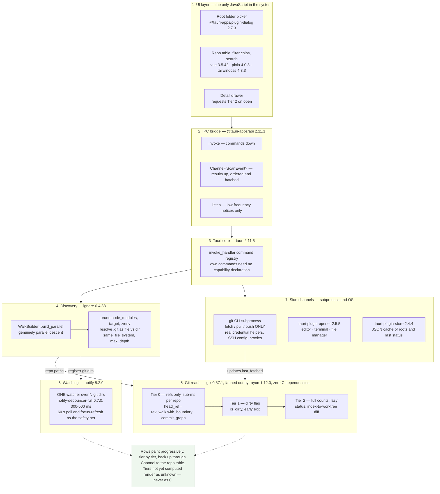

# repo-viewer

Point it at a folder and get a live dashboard of every Git repo beneath it — branch,
ahead/behind, dirty state, file counts — without opening each one in an IDE.

IDEs show you uncommitted changes and unpushed commits one repository at a time. With a few
dozen checkouts under `C:\Working\Source`, answering "what have I not pushed?" means opening
every one. This answers it in a single view.

A Tauri 2 desktop app: Rust backend, Vue 3 frontend, native installer, no server.

- **[PLAN.md](./PLAN.md)** — the specification: design decisions, roadmap, open questions.
- **[AGENTS.md](./AGENTS.md)** — conventions, hard rules, and the traps. Read before changing code.

---

## How it fits together

Layers 1–2 are the only JavaScript in the system; layer 3 down is Rust.



---

## Requirements

### To run it

Nothing. The frontend is bundled into the native binary — no Node, no Rust.

| Platform | Notes |
|---|---|
| Windows 11 | WebView2 is inbox; nothing to install |
| Windows 10 1803+ | WebView2 present on almost all devices; the installer's bootstrapper covers the rest |
| macOS 10.15+ | WKWebView is part of the OS |
| Ubuntu 22.04+ / Debian 12+ | `apt` pulls `libwebkit2gtk-4.1-0` from the `.deb` |

Ubuntu 20.04 and Debian 11 are **not supported** — Tauri 2 needs webkit2gtk **4.1**, which those
releases do not ship. See [PLAN.md §10](./PLAN.md) for the full platform matrix.

The `git` CLI is needed only for fetch/pull/push. Viewing status works without it; those actions
disable themselves with an explanation if it is absent.

### To build it

| | |
|---|---|
| Node.js | 22.13+ — corepack fetches pnpm from `packageManager` |
| Rust | via `rustup`, MSVC host (`x86_64-pc-windows-msvc`). MSRV **1.85**, set by `gix` |
| Windows | VS C++ build tools — `MSVC v… C++ x64/x86 build tools (Latest)` + `Windows 11 SDK`. Nothing else from the C++ workload is needed |
| macOS | Xcode Command Line Tools |
| Linux | `libwebkit2gtk-4.1-dev`, `build-essential`, `libssl-dev`, `librsvg2-dev`, `libxdo-dev` |

Verify a Windows toolchain with a real link, not a version print:

```sh
cargo new --bin /tmp/linkcheck && cd /tmp/linkcheck && cargo build
```

`@tauri-apps/cli` is a project dependency, not a global install. The Tauri bundler downloads WiX
and NSIS on the first `tauri build`, so that build needs network access.

---

## Getting started

```sh
pnpm install            # or: vp install
```

`vp` is the entry point for every command — it fronts Vite, Vitest, oxlint, oxfmt, and the task
runner. Never call `pnpm` / `npm` / `yarn` scripts directly; see [AGENTS.md](./AGENTS.md).

| Task | Command |
|---|---|
| Dev (Vite + Tauri window, hot reload) | `vp run dev` |
| Frontend only, in a browser | `vp dev` |
| Type-check, lint, format, test | `vp check` |
| Fix what is auto-fixable | `vp check --fix` |
| Unit tests | `vp test run` |
| Production build + installer | `vp run build` |
| Rust checks | `cargo fmt --check && cargo clippy --all-targets -- -D warnings && cargo test` |
| Scan a tree without the GUI | `cargo run --release --example scan -- C:/Working/Source` |

---

## Layout

```
repo-viewer/
├── Cargo.toml                    # [workspace] + [workspace.dependencies]
├── package.json                  # one package; vp fronts every command
├── pnpm-workspace.yaml           # catalog: only — every version exact, declared once
├── vite.config.ts                # vp config: vite + test + lint + fmt + run.tasks
├── azure-pipelines.yml
│
├── src/                          # ── Vue frontend
│   ├── layout/                   # App.vue shell, Header
│   ├── pages/                    # file-based routes; index.vue = /
│   ├── components/
│   │   ├── inputs/               # App*.vue reka-ui wrappers — always use at call sites
│   │   ├── repos/                # RepoTable, RepoRow, FilterBar, DetailDrawer …
│   │   └── feedback/             # AppToaster, ScanProgress
│   ├── scripts/                  # ipc.ts, scan.ts, search.ts, router.ts, utils.ts
│   │   └── generated/            # ts-rs output, committed
│   ├── stores/                   # Pinia: repos, filters, settings
│   ├── styles/                   # main.css, theme.css (custom palette)
│   ├── tests/                    # shared harness only — unit tests sit beside their subject
│   └── types/                    # ambient .d.ts only
│
├── crates/
│   └── repo-scan/                # ── THE ENGINE. Zero Tauri dependency.
│       ├── examples/scan.rs      # run the engine without the GUI
│       ├── src/
│       │   ├── discover/         # parallel walk, prune, .git resolution
│       │   ├── status/           # tier0 / tier1 / tier2 / ahead_behind
│       │   ├── watch/            # one debounced watcher
│       │   ├── fetch.rs          # git CLI subprocess
│       │   ├── model.rs          # RepoStatus and friends
│       │   └── error.rs
│       └── tests/                # fixtures are built into a TempDir, never committed
│
└── src-tauri/                    # ── THIN shell. Tauri glue only.
    ├── tauri.conf.json
    ├── capabilities/             # plugin permissions
    └── src/
        ├── lib.rs                # run(): builder, plugins, state, invoke_handler
        ├── state.rs
        ├── stream.rs             # domain events → tauri::ipc::Channel
        └── commands/             # scan, repo, fetch, config
```

Coming from .NET: there is no `.sln` and no `.csproj`. The root `Cargo.toml` is the workspace
manifest, one `Cargo.toml` per crate replaces project files, and the root `package.json` plus
`pnpm-workspace.yaml` cover the frontend. Visual Studio has weak Rust support — use VS Code with
rust-analyzer, or RustRover.

---

## Licence

Internal to CIT Solutions.
