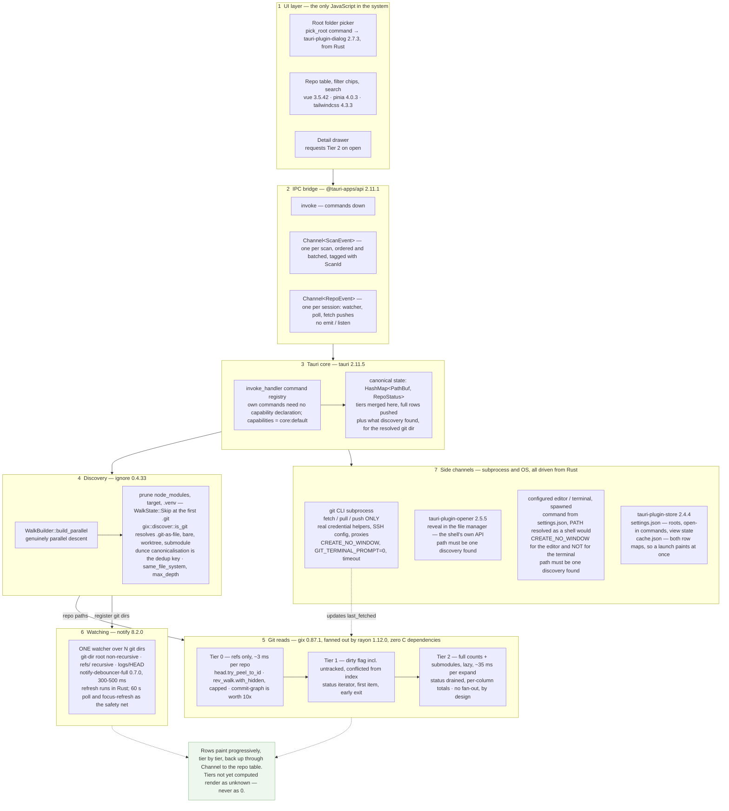

# repo-viewer

Point it at a folder and get a live dashboard of every Git repo beneath it — branch,
ahead/behind, dirty state, file counts — without opening each one in an IDE.

IDEs show you uncommitted changes and unpushed commits one repository at a time. With a few
dozen checkouts under `C:\Working\Source`, answering "what have I not pushed?" means opening
every one. This answers it in a single view.

A Tauri 2 desktop app: Rust backend, Vue 3 frontend, native installer, no server.

- **[PLAN.md](./PLAN.md)** — the specification: design decisions, roadmap, open questions.
- **[AGENTS.md](./AGENTS.md)** — conventions, hard rules, and the traps. Read before changing code.

Status: **the app is useful.** Point it at a folder and it streams every repository beneath it into
a table — rows appear as the walk finds them, then fill in tier by tier: branch, upstream,
ahead/behind, stash count, in-progress state, tip commit and last-fetched age from refs alone, then
the dirty flag and conflicted count from the worktree. Expanding a row reads its full per-file
counts and submodule list on demand, and keeps them when it is collapsed again. Scans are
cancellable and roots are managed in-app. The engine also still works without a GUI, through the
`scan` example. Each phase gets its own runbook in `docs/` while it is being worked on.

---

## How it fits together

Layers 1–2 are the only JavaScript in the system; layer 3 down is Rust.



---

## Requirements

### To run it

Nothing. The frontend is bundled into the native binary — no Node, no Rust.

| Platform                   | Notes                                                                                |
| -------------------------- | ------------------------------------------------------------------------------------ |
| Windows 11                 | WebView2 is inbox; nothing to install                                                |
| Windows 10 1803+           | WebView2 present on almost all devices; the installer's bootstrapper covers the rest |
| macOS 10.15+               | WKWebView is part of the OS                                                          |
| Ubuntu 22.04+ / Debian 12+ | `apt` pulls `libwebkit2gtk-4.1-0` from the `.deb`                                    |

Ubuntu 20.04 and Debian 11 are **not supported** — Tauri 2 needs webkit2gtk **4.1**, which those
releases do not ship. See [PLAN.md §10](./PLAN.md) for the full platform matrix.

The `git` CLI is needed only for fetch/pull/push. Viewing status works without it; those actions
disable themselves with an explanation if it is absent.

Opening a repository in an editor or a terminal runs whatever `settings.json` names — VS Code and
Windows Terminal by default. Neither is required: if the command is missing the button reports why,
beside the row it belongs to. Revealing a folder in the file manager needs nothing installed.

### To build it

|         |                                                                                                                                                                                                                         |
| ------- | ----------------------------------------------------------------------------------------------------------------------------------------------------------------------------------------------------------------------- |
| Node.js | **24** (Active LTS), pinned in `.node-version`. `vp env pin 24.20.0 --target node-version` installs and activates it with no elevated shell. pnpm enforces the version in `packageManager` itself; corepack is not used |
| Rust    | via `rustup`, MSVC host (`x86_64-pc-windows-msvc`). MSRV **1.85**, set by `gix`                                                                                                                                         |
| Windows | VS C++ build tools — `MSVC v… C++ x64/x86 build tools (Latest)` + `Windows 11 SDK`. Nothing else from the C++ workload is needed                                                                                        |
| macOS   | Xcode Command Line Tools                                                                                                                                                                                                |
| Linux   | `libwebkit2gtk-4.1-dev`, `build-essential`, `libssl-dev`, `librsvg2-dev`, `libxdo-dev`                                                                                                                                  |

Verify a Windows toolchain with a real link, not a version print:

```sh
cargo new --bin /tmp/linkcheck && cd /tmp/linkcheck && cargo build
```

`@tauri-apps/cli` is a project dependency, not a global install. The Tauri bundler downloads WiX
and NSIS on the first `tauri build`, so that build needs network access.

---

## Getting started

```sh
vp env pin 24.20.0 --target node-version    # Node 24, no elevated shell needed
vp install
```

`vp` is the entry point for every command — it fronts Vite, Vitest, oxlint, oxfmt, and the task
runner. Never call `pnpm` / `npm` / `yarn` scripts directly; see [AGENTS.md](./AGENTS.md).

The first `vp install` may report dependency build scripts that pnpm has blocked. Add what it names
to `allowBuilds:` in `pnpm-workspace.yaml`.

| Task                                  | Command                                                           |
| ------------------------------------- | ----------------------------------------------------------------- |
| Dev (Vite + Tauri window, hot reload) | `vp run dev`                                                      |
| Frontend only, in a browser           | `vp dev`                                                          |
| Format, lint, `.ts` types             | `vp check`                                                        |
| Fix what is auto-fixable              | `vp check --fix`                                                  |
| Vue SFC + config type-check           | `vp run typecheck`                                                |
| Unit tests                            | `vp test run`                                                     |
| Production build + installer          | `vp run build`, then `vp run verify`                              |
| Regenerate the TypeScript types       | `vp run types`                                                    |
| Rust checks                           | `vp run rust`                                                     |
| Scan a tree without the GUI           | `cargo run --release --example scan -- C:/Working --rows --tier2` |
| Generate a tree to time against       | `cargo run --release --example synth -- <dir> 120 200`            |

---

## Settings

The app keeps three files under its identifier, `net.citsolutions.repoviewer`:

| File                 | What it holds                                                   |
| -------------------- | --------------------------------------------------------------- |
| `settings.json`      | the folders being watched, the open-in commands, the view state |
| `cache.json`         | the last scan's rows, so a launch paints before it rescans      |
| `.window-state.json` | window position and size, written by the window-state plugin    |

On Windows that directory is `%APPDATA%\net.citsolutions.repoviewer`, and on macOS
`~/Library/Application Support/net.citsolutions.repoviewer`. On Linux the first two are under
`~/.local/share/` and the window state is under `~/.config/`: the store plugin resolves Tauri's
app-**data** directory and the window-state plugin its app-**config** directory, which are the same
place on Windows and macOS and two places on Linux.

Deleting any of them is safe: the app treats a missing, corrupt, or unrecognised file as no file at
all, and rebuilds it.

**The editor and terminal commands are edited by hand** — there is no settings screen yet. The
defaults are written into `settings.json` on a first run so the shape is there to change:

```json
{
  "openIn": {
    "editor": { "program": "code", "args": ["{path}"] },
    "terminal": { "program": "wt.exe", "args": ["-d", "{path}"] }
  }
}
```

`{path}` is replaced with the repository's folder, and appended as a final argument if it appears
nowhere — so `{"program": "code"}` on its own works. The program is resolved against `PATH` the way
a shell does, so `code` finds the `code.cmd` that a VS Code install puts there. Changes take effect
on the next launch of a tool, with no restart. On macOS and Linux the terminal is left unset, because
every desktop wants different arguments and a default that silently fails is worse than a message
saying which file to edit.

A cached row is shown with the age of the read that produced it — that is what makes it honest — and
the file counts in a row's drawer are deliberately **not** cached, because they are shown with no age
beside them.

---

## Layout

The target shape. Entries marked with a phase do not exist yet — see the
[roadmap](./PLAN.md#11-roadmap). Everything unmarked is in the repo now.

```
repo-viewer/
├── Cargo.toml                    # [workspace] + [workspace.dependencies] + [profile.release]
├── Cargo.lock                    # workspace root, committed
├── .cargo/config.toml            # TS_RS_EXPORT_DIR + TS_RS_LARGE_INT for type generation
├── .node-version                 # 24.20.0
├── index.html                    # <body> is the mount target
├── package.json                  # one package; vp fronts every command
├── pnpm-workspace.yaml           # catalog + overrides + allowBuilds — every version exact
├── vite.config.ts                # vp config: vite + test + lint + fmt + run.tasks
├── tsconfig.json                 # the app; vue-tsc runs on this
├── tsconfig.node.json            # node types for vite.config.ts; tsgolint discovers it
├── tools/scripts/                # build-frontend.mjs, verify-prod-bundle.mjs
├── azure-pipelines.yml           # ← Phase 8
│
├── src/                          # ── Vue frontend
│   ├── layout/                   # App.vue shell, Header.vue
│   ├── pages/                    # file-based routes; index.vue = /
│   ├── components/               #
│   │   ├── inputs/               #    App*.vue reka-ui wrappers — always use at call sites
│   │   ├── repos/                #    RepoTable, RepoRow, RepoDetail, RepoActions, FilterBar, RootBar …
│   │   └── feedback/             #    AppUnknown, AppAlert, ScanProgress, ScanErrors
│   ├── scripts/                  # ipc.ts, router.ts, scan.ts, detail.ts, view.ts, search.ts, settings.ts, utils.ts
│   │   └── generated/            # ts-rs output, committed
│   ├── stores/                   # Pinia: repos (rows, mirrored), view (chips, sort, grouping)
│   ├── styles/                   # main.css, theme.css (custom palette)
│   ├── tests/                    # shared harness only — unit tests sit beside their subject
│   └── types/                    # ambient .d.ts only; route-map.d.ts is generated, committed
│
├── crates/
│   └── repo-scan/                # ── THE ENGINE. Zero Tauri dependency.
│       ├── examples/             # scan.rs — the engine without a GUI; synth.rs — timing trees
│       ├── src/
│       │   ├── model.rs          # RepoStatus and friends
│       │   ├── error.rs
│       │   ├── discover/         # parallel walk, prune, .git → DiscoveredRepo
│       │   ├── status/           # tier0.rs, tier1.rs, tier2.rs, ahead_behind.rs
│       │   ├── watch/            # ← Phase 6: one debounced watcher
│       │   └── fetch.rs          # ← Phase 7: git CLI subprocess
│       └── tests/                # discover.rs, tier0.rs + support/fixtures.rs, built into TempDirs
│
└── src-tauri/                    # ── THIN shell. Tauri glue only.
    ├── build.rs
    ├── tauri.conf.json
    ├── capabilities/             # core:default only — plugins are called from Rust
    ├── icons/                    # placeholder set; replaced in Phase 8
    └── src/
        ├── main.rs               # calls run(); windows_subsystem = "windows" in release
        ├── lib.rs                # run(): builder, plugins, invoke_handler
        ├── state.rs              # canonical HashMap<PathBuf, RepoStatus>, tier merge
        ├── stream.rs             # batching for tauri::ipc::Channel sends
        ├── pipeline.rs           # the scan driver: discovery → batch → Tier 0 → merge
        ├── persist.rs            # settings.json + cache.json — the only consumer of the store plugin
        ├── error.rs              # CommandError: anyhow across the IPC boundary
        └── commands/            # session, scan, roots, repo, open, settings  (+ fetch — Phase 7)
```

Coming from .NET: there is no `.sln` and no `.csproj`. The root `Cargo.toml` is the workspace
manifest, one `Cargo.toml` per crate replaces project files, and the root `package.json` plus
`pnpm-workspace.yaml` cover the frontend. Visual Studio has weak Rust support — use VS Code with
rust-analyzer, or RustRover.

---

## Licence

Internal to CIT Solutions.
